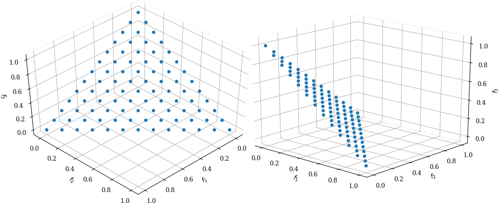
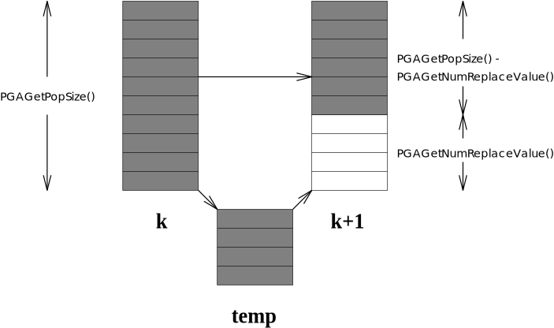

.. _part:userguide:

Users Guide
-----------

.. _chp:structure:

The Structure of PGAPack
++++++++++++++++++++++++

This chapter provides a general overview of the structure of PGAPack.

.. _sec:data-structure:

Native Data Types
~~~~~~~~~~~~~~~~~

PGAPack is a data-structure-neutral library. By this we mean that a
data-hiding capability provides the full functionality of the library to
the user, in a transparent manner, irrespective of the data type used.
PGAPack supports four native data types: binary-valued, integer-valued,
real-valued, and character-valued strings. In addition, PGAPack is
designed to be easily extended to support other data types (see
Chapter :ref:`chp:custom1`).

The binary (or bit) data type (i.e., ``|1|0|1|1|``) is the traditional
GA coding. The bits may either be interpreted literally or decoded into
integer or real values by using either binary coded decimal or
binary-reflected Gray codes. In PGAPack the binary data type is
implemented by using each distinct bit in a computer word as a gene,
making the software very memory-efficient. The integer-valued data type
(i.e., ``|3|9|2|4|``) is often used in routing and scheduling problems.
The real-valued data type (i.e., ``|4.2|7.1|-6.3|0.8|``) is useful in
numerical optimization applications. The character-valued data type
(i.e., ``|h|e|l|l|o|w|o|r|l|d|``\ is useful for symbolic applications.

.. _sec:context:

Context Variable
~~~~~~~~~~~~~~~~

In PGAPack the *context variable* is the data structure that provides
the data hiding capability. The context variable is a pointer to a C
language structure, which is itself a collection of other structures.
These (sub)structures contain all the information necessary to run the
genetic algorithm, including data type specified, parameter values,
which functions to call, operating system parameters, debugging flags,
initialization choices, and internal scratch arrays. By hiding the
actual data type selected and specific functions that operate on that
data type in the context variable, user-level functions in PGAPack can
be called independent of the data type.

Almost all fields in the context variable have default values. However,
the user can set values in the context variable by using the
:ref:`PGASet <group:init>`
family of function calls. The values of fields in the context variable
may be read with the :ref:`PGAGet <group:query>` family of function calls.

.. _sec:usage:

Levels of Usage Available
~~~~~~~~~~~~~~~~~~~~~~~~~

PGAPack provides multiple levels of control to support the requirements
of different users. At the simplest level, the genetic algorithm
“machinery” is encapsulated within the :c:func:`PGARun` function, and the user
need specify only three parameters: the data type, the string length,
and the direction of optimization. All other parameters have default
values. At the next level, the user calls the data-structure-neutral
functions explicitly (e.g., :c:func:`PGASelect`, :c:func:`PGACrossover`,
:c:func:`PGAMutate`).
This mode is useful when the user wishes more explicit control over the
steps of the genetic algorithm or wishes to hybridize the genetic
algorithm with a hill-climbing heuristic. At the third level, the user
can customize the genetic algorithm by supplying his or her own
function(s) to provide a particular operator(s) while still using one of
the native data types. Finally, the user can define his or her own
datatype, write the data-structure-specific low-level GA functions for
the datatype (i.e., crossover, mutation, etc.), and have the
data-structure-specific functions executed by the high-level
data-structure-neutral PGAPack functions.

.. _sec:function:

Function Call-Based Library
~~~~~~~~~~~~~~~~~~~~~~~~~~~

All the access to, and functionality of, the PGAPack library is provided
through function calls.

-  The :ref:`PGASet <group:init>` family of functions sets parameter
   values, allele values, and specifies which GA operators to use. For
   example, ``PGASetPopSize (ctx, 500)`` sets the GA population size to
   500.

-  The :ref:`PGAGet <group:query>` family of functions returns the
   values of fields in the context variable and allele values in the
   string. For example, ``bit = PGAGetBinaryAllele (ctx, p, pop, i)``
   returns the value of the ``i``\ th bit in string ``p`` in population
   ``pop`` into ``bit``.

-  The simplest level of usage is provided by the :c:func:`PGARun` function.
   This function will run the genetic algorithm by using any nondefault
   values specified by the user and default values for everything else.

-  The next level of usage is provided by the data-structure-neutral
   functions, which the user can call to have more control over the
   specific steps of the genetic algorithm. Some of these functions are
   :c:func:`PGASelect`, :c:func:`PGACrossover`, :c:func:`PGAMutate`,
   :c:func:`PGAEvaluate`, and :c:func:`PGAFitness`.

-  The :ref:`data-structure-specific functions <group:internal>`
   deal directly with native data types. In general, the user never
   calls these functions directly.

-  System calls in PGAPack provide
   :ref:`miscellaneous functionality <group:utility>`,
   including :ref:`debugging <group:debug>`,
   :ref:`random number generation <group:random>`,
   :ref:`output control, and error reporting <group:reporting>`.

.. _sec:header:

Header File and Symbolic Constants
~~~~~~~~~~~~~~~~~~~~~~~~~~~~~~~~~~

The PGAPack header file contains symbolic constants and type definitions
for all functions and should be included in any file (or function or
subroutine in Fortran) that calls a PGAPack function. For example,
:c:macro:`PGA_CROSSOVER_UNIFORM` is a symbolic constant that is used as an
argument to the function :c:func:`PGASetCrossoverType` to specify uniform
crossover. In C the header file is ``pgapack.h``. In Fortran it is
``pgapackf.h``

.. _sec:evalfunc:

Evaluation Function
~~~~~~~~~~~~~~~~~~~

PGAPack requires that the user supply a function that returns an
evaluation of a string that it will map to a fitness value. This
function is called whenever a string evaluation is required. The calling
sequence and return value of the function must follow the format
discussed in Section :ref:`sec:evaluation`.

.. _sec:parallel:

Parallelism
~~~~~~~~~~~

PGAPack can be run on both sequential computers (uniprocessors) and
parallel computers (multiprocessors, multicomputers, and workstation
networks). The parallel programming model used is message passing, in
particular the single program, single data (SPMD) model. PGAPack
supports sequential and parallel implementations of the global
population model (see Chapter :ref:`chp:parallel`).

.. _sec:implement:

Implementation
~~~~~~~~~~~~~~

PGAPack is written in ANSI C. A set of interface functions allows most
user-level PGAPack functions to be called from Fortran. All
message-passing calls follow the Message Passing Interface (MPI)
standard [MPI94]_, [GLS94]_, [MPI21]_. Nonoperative versions
of the basic MPI functions used in the examples are supplied if the user
does not provide an MPI implementation for their machine. These routines
simply return and provide *no* parallel functionality. Their purpose is
to allow the PGAPack library to be built in the absence of an MPI
implementation.

Most low-level internal functions in PGAPack are data-structure
*specific* and use addresses and/or offsets of the population data
structures. The user-level routines, however, provide the abstractions
of data-structure *neutrality* and an integer indexing scheme for access
to population data structures.

.. _chp:functionality:

Basic Usage
+++++++++++

As the examples in Chapter :ref:`chp:examples` show, a PGAPack program
can be written with just four function calls and a string evaluation
function. This basic usage is discussed further in
Section :ref:`sec:big-picture`.
Sections :ref:`sec:stopping-criteria` to :ref:`sec:utility`
explain options available in PGAPack. Section :ref:`sec:cla`
discusses PGAPack command line arguments.

.. _sec:big-picture:

Required Functions
~~~~~~~~~~~~~~~~~~

Any file (or function or subroutine in C and Fortran) that uses a
PGAPack function must include the PGAPack header file. In C this file is
``pgapack.h``. In Fortran this file is ``pgapackf.h``. The first
PGAPack call made is *always* to :c:func:`PGACreate`. In C this call looks
like

.. code-block:: c

   PGAContext *ctx;
   ctx = PGACreate (&argc, argv, datatype, len, maxormin);

:c:func:`PGACreate` allocates space for the context variable, ``ctx``
(Section :ref:`sec:context`), and returns its address. ``argc`` and
``argv`` are the standard list of arguments to a C program. ``datatype``
must be one of the constants defined in group :ref:`group:const-datatype`
to specify strings
consisting of binary-valued, integer-valued, real-valued,
character-valued or user-defined strings, respectively.
The parameter ``len`` is the length of the
string (i.e., the number of genes), ``maxormin`` must be one in group
:ref:`group:const-opt-dir` to indicate whether the user’s
problem is maximization or minimization, respectively.

In Fortran the call to :c:func:`PGACreate` is

.. code-block:: fortran

   integer ctx
   ctx = PGACreate (datatype, len, maxormin)

where ``datatype``, ``len``, and ``maxormin`` are the same as for C
programs. After the :c:func:`PGACreate` call, the user may *optionally* set
nondefault values. These are then followed by a call to :c:func:`PGASetUp` to
initialize to default values all options, parameters, and operators not
explicitly specified by the user. For example,

.. code-block:: c

   ctx = PGACreate (&argc, argv, datatype, len, maxormin);
   PGASetPopSize              (ctx, 500);
   PGASetFitnessType          (ctx, PGA_FITNESS_RANKING);
   PGASetCrossoverType        (ctx, PGA_CROSSOVER_UNIFORM);
   PGASetUniformCrossoverProb (ctx, 0.6);
   PGASetUp                   (ctx);

will change the default values for the population size, the mapping of
the user’s evaluation to a fitness value, and the crossover type. All
:ref:`PGASet <group:init>` calls should be made *after* :c:func:`PGACreate`
has been called,
but *before* :c:func:`PGASetUp` has been called; all such calls are
*optional*. Note also that *all* PGAPack functions other than
:c:func:`PGACreate` take the context variable as their first argument.

The :c:func:`PGARun` function executes the genetic algorithm. Its second
argument is the name of a user-supplied evaluation function that returns
a ``double`` (``double precision`` in Fortran) value that is the user’s
evaluation of an individual string. In C the prototype for this function
looks like

.. code-block:: c

   double evaluate (PGAContext *ctx, int p, int pop, double *aux);

and in Fortran

.. code-block:: fortran

   double precision function evaluate (ctx, p, pop, aux)
   integer ctx, p, pop
   double precision aux(*)

The user *must* write the evaluation function, and it *must* have the
calling sequence shown above and discussed further in
Section :ref:`sec:evaluation`, except that depending on the
architecture and the calling convention of the compiler, the ``aux``
argument can be left out. After :c:func:`PGARun` terminates,
:c:func:`PGADestroy` is called to release all memory allocated by
PGAPack.  [#]_

Except for writing an evaluation function
(Section :ref:`sec:evaluation`) the information contained in rest of
this chapter is optional---defaults will be set for all other GA
parameters. We do note, however, that the defaults used are the result
of informal testing and results reported in the GA literature. *They are
by no means optimal*, and additional experimentation with other values
may well yield better performance on any given problem.

.. [#] :c:func:`PGADestroy` will also call ``MPI_finalize``, if MPI was
       started by :c:func:`PGACreate`.

.. _sec:population-replacement:

Population Replacement
~~~~~~~~~~~~~~~~~~~~~~

PGAPack supports several different population replacement schemes. Among
them the two most common replacement schemes in the literature. The
first, the *generational replacement* genetic algorithm (GRGA), replaces
the entire population each generation and is the traditional genetic
algorithm [Hol92]_. The second, the *steady-state*
genetic algorithm (SSGA), typically replaces only a few strings each
generation and is a more recent development
[Sys89]_, [Whi89]_, [WK88]_. A third scheme, originally called
*restricted tournament selection* by Harik
[Har94]_, [Har95]_ and later adopted under the name of
*restricted tournament replacement* by Pelikan [Pel05]_
replaces offspring candidates into the original population by selecting
a number of members from the original population and selecting the
member most similar to the candidate. The similarity metric is
implemented by a genetic distance function see
section :ref:`sec:basics`. The candidate is then compared to
the most similar member and only if the new solution candidate is better
than the member it replaces it. This approach is repeated for each new
solution. A fourth approach used by evolutionary algorithm variants that
mutate an individual into an offspring that replaces its parent only
when it is better is also supported. This variant is used by the popular
Differential Evolution [SP95]_, [SP97]_, [PSL05]_ algorithm. We
call this replacement variant *pairwise best* in the following.
Individuals with the same index in the old and the new population are
compared and the one with the better fitness is used.

Two algorithms are typically used for multi-objective optimization. The
first one is the elitist Nondominated Sorting Genetic Algorithm
(Version 2), NSGA-II [DPAM02]_ and is called NSGA-II
replacement. It can be used for single-objective optimization, too, both
with and without constraints. If constraints are present, by default the
constraint violations are summed. An alternative is to use nondominated
sorting for constraints, too. This can be switched on by setting
:c:func:`PGASetSumConstraintsFlag` to :c:macro:`PGA_FALSE`.

The second is the Nondominated Sorting Genetic Algorithm for
many-objective optimization, NSGA-III [DJ14]_,
[JD14]_. NSGA-II and NSGA-III are the only possible
population replacement algorithms when using multi-objective
optimization.

Both, NSGA-II and NSGA-III use non-dominated sorting of the union of the
old and the new population. This establishes ranks of non-domination
among members of the population. The non-dominated sorting uses an
:math:`O(n^2\cdot m)` algorithm in the original NSGA-II paper [DPAM02]_
(:math:`n` being the population size and :math:`m` the number of
objectives) and was also implemented this way in PGAPack. This algorithm
has recently been replaced with Jensen's divide-and-conquer algorithm
[Jen03]_, later modified to correctly handle equal evaluations by Fortin
et. al. [FGP13]_.  It has later been shown that a slightly modified
version of the algorithm is :math:`O\left(n\cdot \log(n)^{m-1}\right)`
by Buzdalov and Shalyto [BS14]_.  The authors of that paper think that
the approximate runtime effort also applies to the original Jensen
algorithm.

By default the new Jensen algorithm -- which is strictly faster than the
old NSGA-II algorithm with a population size larger than 100 -- is used.
The old algorithm can still be selected by calling :c:func:`PGASetSortND`
with the constant :c:macro:`PGA_NDSORT_NSQUARE`. For testing the old
against the new algorithm, this function can be called with
:c:macro:`PGA_NDSORT_BOTH` which runs both algorithms and compares the
results. You should never need to set this unless you suspect a bug in
the Jensen algorithm or want to compare runtimes. The default is
:c:macro:`PGA_NDSORT_JENSEN`.

With NSGA-III you need to define a regular set of points or a set of
directions where you want solutions to the multi-objective problem to be
found, both can be combined, you can specify both, a number of reference
directions and reference points. The reference points are in a
hyperplane defined by the M positive axes of the objective space, the
hyperplane goes through the axes intercepts at coordinate 1 for each of
the axes. An example for three objectives with a partition size of 12 is
shown in figure :ref:`fig:refpoints`.

   Reference points in 3 dimensions, partition-size 12

The discovered pareto-front is projected onto this hyperplane
[BDR19]_. When specifying reference directions, these
are directly defined in the objective space (without any projection).

To compute a set of points we use an algorithm originally defined in a
paper by I. Das and J. E. Dennis [DD98]_ with the
function :c:func:`LIN_dasdennis`. This function gets the dimension (the number
of objectives to optimize which is the number of auxiliary evaluations
+1 minus the number of constraints) and the number of partitions. It
returns the points in ``result`` and optionally takes a scale factor in
the range 0..1 and a direction to shift this scaled set of points. The
direction is only needed if the scale factor is less than one. The first
time the function is called, the result must point at a NULL pointer.
The function automatically allocates the necessary memory. It can be
called multiple times to extend the points already allocated. The
resulting points are then passed into the function
:c:func:`PGASetReferencePoints`:

.. code-block:: c

   int npoints = 0;
   void *result = NULL;
   double point [3] = {1, 1, 1};

   PGASetNumAuxEval (ctx, 2);
   PGASetNumConstraint (ctx, 0);
   npoints = LIN_dasdennis (3, 2, &result, 0, 1, NULL);
   npoints = LIN_dasdennis (3, 1, &result, npoints, 0.5, point);
   PGASetReferencePoints (ctx, npoints, result);

Note that if :c:func:`PGASetReferencePoints` is not called by the user,
reference points are automatically allocated when calling :c:func:`PGASetUp`.
All reference points are freed when calling :c:func:`PGADestroy`, so
reference points must always be allocated using malloc (which is done
when using :c:func:`LIN_dasdennis`).

For defining reference directions, the function
:c:func:`PGASetReferenceDirections` is used. It gets the number of directions
and the vector of directions (each direction is a vector of the
dimensionality of the number of objectives) and the number of partitions
(for Das/Dennis points) and the scale factor of the generated points:

.. code-block:: c

       double directions [][3] = {{1, 1, 1}, {1, 2, 3}};
       PGASetReferenceDirections (ctx, 2, directions, 12, 0.05);

The difference to the reference points above is that the reference
directions are in the objective space and the Das/Dennis points are
generated dynamically in each generation.

Note that by default when no population size is specified, NSGA-III uses
the number of points defined by the reference points and reference
directions for the population size.

The NSGA-III replacement optimizes the solutions to be near the
reference points and/or reference directions. With a high number of
objective functions, the N-dimensional space forming the solution space
increases exponentially with the number of objective functions. This is
known as the “curse of dimensionality”. With NSGA-II it is increasingly
hard to find a well distributed set of solutions with more than two or
three objectives. With the NSGA-III replacement it is possible to
concentrate the search to a predefined number of reference points or
reference directions.

PGAPack supports both GRGA and SSGA and variants in between via
*parameterized* population replacement. For example, the
:ref:`PGASet <group:init>` calls

.. code-block:: c

   PGASetPopSize         (ctx, 200);
   PGASetNumReplaceValue (ctx, 10);
   PGASetPopReplaceType  (ctx, PGA_POPREPL_BEST);

specify that each generation a new population is created consisting of
ten strings created via recombination, and the 190 most fit strings from
the old population. The 190 strings can also be selected randomly, with
or without replacement, by setting the second argument of
:c:func:`PGASetPopReplaceType` to :c:macro:`PGA_POPREPL_RANDOM_REP` or
:c:macro:`PGA_POPREPL_RANDOM_NOREP`, respectively.

For selecting restricted tournament replacement :c:macro:`PGA_POPREPL_RTR` is
used. The default for the window size (number of members of the old
population that are chosen for comparison with a new candidate) is
min :math:`(n, N/20)` where :math:`n` is the string length and :math:`N`
is the population size [Pel05]_. The window size can be
set or queried with :c:func:`PGASetRTRWindowSize` and
:c:func:`PGAGetRTRWindowSize`,
respectively. Note that when restricted tournament replacement is in
use, the maximum number of new candidates is limited with the number set
with :c:func:`PGASetNumReplaceValue` but fewer—depending on fitness–may be
replaced into the new population. Note that it depends on the selection
which individuals in the old population are replaced. Since restricted
tournament replacement is an elitist strategy the overall fitness never
dimishes with this replacement strategy.

For pairwise best replacement :c:macro:`PGA_POPREPL_PAIRWISE_BEST` is used as
the replacement type. Like restricted tournament replacement it is an
elitist strategy.

For NSGA-II replacement :c:macro:`PGA_POPREPL_NSGA_II` is used. For NSGA-III
replacement :c:macro:`PGA_POPREPL_NSGA_III` is used. The number of auxiliary
evaluation function can be set with :c:func:`PGASetNumAuxEval` and the number
of constraints can be set with :c:func:`PGASetNumConstraint`. If the
difference between the two is :math:`>0` (i.e. the number of objectives
is :math:`>1`), these auxiliary evaluations are used for multi-objective
optimization. Only the NSGA-II and NSGA-III replacement are possible
with these settings (i.e. when the number of objectives is :math:`>1`).

The replacement types *pairwise best*, *restricted tournament
replacement*, NSGA-II, and NSGA-III replacement have selection pressure
in addition to providing a population replacement strategy. So these can
be used if a selection scheme without selection pressure (a tournament
strategy with only one participant in the tournament or linear
selection) is used.

By default, the number of new strings created each generation is 10
percent of the population size (an SSGA population replacement
strategy). A GRGA can be implemented by setting
:c:func:`PGASetNumReplaceValue` to the population size (the default population
size is 100). Setting :c:func:`PGASetNumReplaceValue` to one less than the
population size will result in an elitist GRGA, where the most fit
string is always copied to the new population (since
:c:macro:`PGA_POPREPL_BEST` is the default population replacement strategy).

Traditionally, strings created through recombination first undergo
crossover and then mutation. Some practitioners [Dav91]_
have argued that these two operators should be separate. By default,
PGAPack applies mutation only to strings that did *not* undergo
crossover.

This is equivalent to setting :c:func:`PGASetMixingType` to
:c:macro:`PGA_MIX_MUTATE_OR_CROSS` which is also the default. To have strings
undergo *both* crossover and mutation, one should set
:c:func:`PGASetMixingType` to :c:macro:`PGA_MIX_TRADITIONAL`. Note that
there is also a mode that will not mutate strings that are not also
crossed over. This can be enabled by setting :c:func:`PGASetMixingType`
to :c:macro:`PGA_MIX_MUTATE_AND_CROSS`.

If an evolutionary algorithm variant without crossover is used or if
special crossover techniques with more that two parents should be
applied, all the logic can be implemented in a custom crossover operator
and the :c:func:`PGASetMixingType` can be set to
:c:macro:`PGA_MIX_MUTATE_ONLY`. In this mode no crossover is performed
at all.

There is also a legacy interface which should *not* be used for new
code. Functions used in that interface are:
:c:func:`PGASetMutationOrCrossoverFlag`,
:c:func:`PGASetMutationAndCrossoverFlag`,
and :c:func:`PGASetMutationOnlyFlag`.

By default, PGAPack allows duplicate strings in the population. Some
practitioners advocate not allowing duplicate strings in the population
in order to maintain diversity. The function call
:c:func:`PGASetNoDuplicatesFlag` with the parameters ``(ctx, PGA_TRUE)``
will not allow duplicate
strings in the population: It repeatedly applies the mutation operator
(with an increasing mutation rate) to a duplicate string until it no
longer matches any string in the new population. If the mutation rate
exceeds 1.0, however, the duplicate string *will* be allowed in the
population, and a warning message will be issued.

Figure :ref:`fig:popreplace` shows the generic population
replacement scheme in PGAPack. Both populations :math:`k` and
:math:`k+1` are of fixed size (the value returned by :c:func:`PGAGetPopSize`).
First, :c:func:`PGAGetPopSize` - :c:func:`PGAGetNumReplaceValue`
strings are copied
over directly from generation :math:`k`. The way the strings are chosen,
the most fit, or randomly with or without replacement, depends on the
value set by :c:func:`PGASetPopReplaceType`. The remaining
:c:func:`PGAGetNumReplaceValue` strings are created by crossover and mutation.

   Population Replacement

.. _sec:stopping-criteria:

Stopping Criteria
~~~~~~~~~~~~~~~~~

PGAPack terminates when at least one of the stopping rule(s) specified
has been met. The three stopping rules are (1) iteration limit exceeded,
(2) population too similar, and (3) no change in the best solution found
in a given number of iterations. The default is to stop when the
iteration limit (by default, 1000 iterations) is reached. Note that when
:math:`\epsilon`-constraint optimization is in use, stopping is not
triggered as long as :math:`\epsilon>0`, see
section :ref:`sec:evaluation`.

The choice of stopping rule is set by :c:func:`PGASetStoppingRuleType`. For
example, :c:func:`PGASetStoppingRuleType` with parameters
``(ctx, PGA_STOP_MAXITER)`` is the
default. Other choices are :c:macro:`PGA_STOP_TOOSIMILAR` and
:c:macro:`PGA_STOP_NOCHANGE` for population too similar and no change in the
best solution found, respectively. :c:func:`PGASetStoppingRuleType` may be
called more than once. The different stopping rules specified are
*or*\ ed together.

If :c:macro:`PGA_STOP_MAXITER` is one of the stopping rules,
:c:func:`PGASetMaxGAIterValue` with parameters ``(ctx, 500)``
will change the maximum iteration limit to 500. If
:c:macro:`PGA_STOP_NOCHANGE` is one of the stopping rules,
:c:func:`PGASetMaxNoChangeValue` with parameters ``(ctx, 50)`` will
change from 100 (the default) to 50 the maximum number of iterations in
which no change in the best evaluation is allowed before the GA stops.
If :c:macro:`PGA_STOP_TOOSIMILAR` is one of the stopping rules,
:c:func:`PGASetMaxSimilarityValue` with parameters ``(ctx, 99)`` will
change from 95 to 99 the percentage of the population allowed to have
the same evaluation function value before the GA stops.

.. _sec:initialization:

Initialization
~~~~~~~~~~~~~~

Strings are either initialized randomly (the default), or set to zero.
The choice is specified by setting the second argument of
:c:func:`PGASetRandomInitFlag` to either :c:macro:`PGA_TRUE` or
:c:macro:`PGA_FALSE`, respectively. Random initialization depends on the
datatype.

If binary-valued strings are used, each gene is set to ``1`` or ``0``
with an equal probability. To set the probability of randomly setting a
bit to ``1`` to 0.3, use :c:func:`PGASetBinaryInitProb` with parameters
``(ctx, 0.3)``.

For integer-valued strings, the default is to set the strings to a
permutation on a range of integers. The default range is
:math:`[0,L-1]`, where :math:`L` is the string length.
:c:func:`PGASetIntegerInitPermute` with parameters ``(ctx, 500, 599)``
will set the permutation
range to :math:`[500,599]`. The length of the range *must* be the same
as the string length.

Alternatively, :c:func:`PGASetIntegerInitRange` will set each gene to a random
value selected uniformly from a specified range. For example, the code

.. code-block:: c

   stringlen = PGAGetStringLength (ctx);
   for (i=0;i<stringlen;i++) {
       low[i]  = 0;
       high[i] = i;
   }
   PGASetIntegerInitRange (ctx, low, high);

will select a value for gene ``i`` uniformly randomly from the interval
:math:`[0,i]`.

If real-valued strings are used, the alleles are set to a value selected
uniformly randomly from a specified interval. The interval may be
specified with either the :c:func:`PGASetRealInitRange` or
:c:func:`PGASetRealInitFraction` functions. For example, the code

.. code-block:: c

   stringlen = PGAGetStringLength (ctx);
   for (i=0; i<stringlen; i++) {
       low[i]  = -10.0;
       high[i] = (double) i;
   }
   PGASetRealInitRange (ctx, low, high);

will select a value for allele ``i`` uniformly randomly from the
interval :math:`[-10.0,{\tt i}]`. This is the default strategy for
initializing real-valued strings. The default interval is
:math:`[0,1.0]`.

:c:func:`PGASetRealInitFraction` specifies the interval with a median
value and fraction of the median as offset. For example,

.. code-block:: c

   stringlen = PGAGetStringLength (ctx);
   for (i=1; i<=stringlen; i++) {
       median  [i-1] = (double)  i;
       percent [i-1] =          .5;
   }
   PGASetRealInitFraction (ctx, median, percent);

will select a value for allele ``i`` uniformly randomly from the
increasing intervals :math:`[\frac{1}{2}i,\frac{3}{2}i]`. Note that if
the median value is zero for some :math:`i`, then an interval of
:math:`[0,0]` will be defined.

If character-valued strings are used,
:c:func:`PGASetCharacterInitType` with parameters ``(ctx, PGA_CINIT_UPPER)``
will set the allele
values to uppercase alphabetic characters chosen uniformly randomly.
Other options are :c:macro:`PGA_CINIT_LOWER` for lower case letters only (the
default) and :c:macro:`PGA_CINIT_MIXED` for mixed case letters, respectively.

.. _sec:selection:

Selection
~~~~~~~~~

The selection phase allocates reproductive trials to strings on the
basis of their fitness. PGAPack supports five selection schemes:
proportional selection, stochastic universal selection, truncation
selection, tournament selection (default is binary tournament
selection), and probabilistic binary tournament selection. A sixth
scheme which is called *linear selection* that is not a selection scheme
in the genetic sense (it has no selection pressure) is used for
evolutionary algorithms that rely on modification of individuals that
later replace their parent if the offspring has higher fitness, so the
selection pressure is applied in the replacement strategy. The linear
scheme is guaranteed to return individuals in population order.

The choice may be specified by setting the second argument of
:c:func:`PGASetSelectType` to one of the constants in group
:ref:`group:const-selection`.  The default is tournament selection. For
tournament selection, the size of the tournament (number of
participants) can be set e.g., with :c:func:`PGASetTournamentSize` with
parameters ``(ctx, 3)``.
The default is binary tournament (size = 2). To allow a more
fine-grained selection pressure, the tournament size is a floating-point
value. The integer part of that value specifies the minimum tournament
size. For each tournament for the fractional part, a biased coin is
flipped (using :c:func:`PGARandomFlip`) and the tournament size is increased
by one if the outcome is positive. This mechanism for fine-grained
tournaments was first proposed by Harik and Goldberg
[HG96]_ and later rediscovered by Filipović et. al. [FKTL00]_.

Note that with a tournament size of 1 (or with the linear selection
scheme) there is no selection pressure. Having no selection pressure in
this step can be compensated by using a replacement scheme with
selection pressure, i.e., one of restricted tournament replacement or
pairwise best replacement, see
section :ref:`sec:population-replacement` for details on population
replacement. If no selection pressure is used in the selection scheme
*and* in the population replacement strategy, the genetic search
degenerates to a random walk.

In addition, for tournament selection it can be specified if the
selection is *with* or *without* replacement using the function
:c:func:`PGASetTournamentWithReplacement` with a parameter of
:c:macro:`PGA_FALSE` or :c:macro:`PGA_TRUE`. Sampling without
replacement guarantees that for :math:`n` tournaments, each individual
participates in the same number of tournaments (as long as :math:`n`
multiplied by the tournament size is a multiple of the population size)
[GKD89]_. This was later re-invented by Sokolov and Whitley under the
name *Unbiased Tournament Selection* [SW05]_.

The default sampling is ``with`` replacement as if
:c:func:`PGASetTournamentWithReplacement` had been called with the parameter
:c:macro:`PGA_TRUE`. The probabilistic tournament selection is always binary
(two participants in the tournament), the default probability that the
string that wins the tournament is selected is 0.6. It may be set to
0.8, for example, with :c:func:`PGASetPTournamentProb` with parameters
``(ctx, 0.8)``. The
tournament for probabilistic tournament selection is always with
replacement. The truncation selection by default selects half of the
population. This proportion of selected individuals can be set with
:c:func:`PGASetTruncationProportion` for which the default value is 0.5.

When using multi-objective optimization with, e.g., the NSGA-II
[DPAM02]_ population replacement (see
section :ref:`sec:population-replacement`), it is possible to either
use a selection scheme with or without selection pressure. However,
selection schemes that rely on direct comparison of individuals (e.g.
tournament selection) will sort by the domination rank of the
individuals established by the NSGA-II algorithm. This is because for
multi-objective optimization there is no full order established by
multiple objectives as would be the case for single-objective
optimization. This may result in less selection pressure because
multiple individuals will typically have the same rank. This lower
selection pressure is compensated by the selection pressure introduced
by the NSGA-II (or -III) population replacement algorithm.

Most selection schemes (except stochastic universal selection) already
return a randomized sequence. In previous implementations *all*
sequences got an additional randomization step. By default this is no
longer the case (exect for :c:macro:`PGA_SELECT_SUS`). You can enable the
previous behavior by setting it to :c:macro:`PGA_TRUE` with
:c:func:`PGASetRandomizeSelect`. Note that even with this flag set, the
sequence returned by the linear selection scheme is never randomized.
This has adverse effects on crossover with linear selection: With this
scheme the same two adjacent population members are always crossed over
which makes crossover almost ineffective. Linear selection is typically
only useful when using special mutation operators most often with
:c:func:`PGASetMixingType` set to :c:macro:`PGA_MIX_MUTATE_ONLY`. If you
need a randomized sequence without selection pressure, use tournament
selection without replacement with a tournament size of one.

.. _sec:crossover:

Crossover
~~~~~~~~~

The crossover operator takes bits from each parent string and combines
them to create child strings. The type of crossover may be specified by
setting :c:func:`PGASetCrossoverType` to one of the constants in group
:ref:`group:const-crossover`. The possible crossover types are
one-point, two-point, uniform, or simulated
binary (SBX) crossover, respectively.

For integer alleles there are also
Edge Recombination Crossover (ERX) [WSS91]_, Partially Mapped Crossover
(PMX) [GL85]_, Modified Crossover (MX) [Dav85]_, Cycle Crossover (CX) [OSH87]_,
Order Crossover (OX) [OSH87]_, Order Based Crossover (OBX) [Sys91]_,
Position Based Crossover (PBX) [Sys91]_, Alternating Edge Crossover
(AEX) [GGRG85]_, and Uniform Order Based Crossover (UOX) [Dav91b]_.
For these the integer gene needs to be initialized to be a
permutation, these variants preserve the property that the gene is a
permutation, see section :ref:`sec:crossover-permutations` for details.

For the Edge Recombination Crossover some edges can be defined to be
fixed (unmutable). This is done with the
:c:func:`PGAIntegerSetFixedEdges`. An example is given in
``examples/sequence``.

The default is two-point crossover. By default the crossover rate is
0.85. It may be set to 0.6 by :c:func:`PGASetCrossoverProb` with
parameters ``(ctx, 0.6)``, for example. Simulated binary crossover is
available only for integer and real genes.

Uniform crossover and simulated binary crossover are parameterized by
:math:`p_u`, the probability of swapping two parent bit values
[SD91]_ in the case of uniform crossover and for
mutating an allele for SBX. By default, :math:`p_u = 0.5`. The function
call :c:func:`PGASetUniformCrossoverProb` with parameters ``(ctx, 0.7)``
will set :math:`p_u = 0.7`.

SBX uses a polynomial distribution with a parameter :math:`\eta_c` that
defines how far the child may deviate from each parent. For high values
of this parameter, children stay nearer to the parents
[DA95]_. Recommended values of this parameter are
typically in the range 2–5, the default is 2 and a different value can
be set with :c:func:`PGASetCrossoverSBXEta`.

When crossing strings with SBX, typically for each allele a new random
number is computed for the polynomial distribution. With
:c:func:`PGASetCrossoverSBXOncePerString` you can define that a random number
is only drawn once for each individual to be crossed over. This ensures
that the child is on the line in N-dimensional space between the two
parents *if all alleles are crossed over*. This may be beneficial when
handling optimization problems that are not decomposable [Sal96]_
similar to the crossover rate in differential evolution [PSL05]_.

Crossover types that may yield child individuals outside the range of
the parents (currently only SBX) may want to call
:c:func:`PGASetCrossoverBoundedFlag` or
:c:func:`PGASetCrossoverBounceBackFlag` with
the context variable and :c:macro:`PGA_TRUE` to select an algorithm that keeps
the child alleles within the bounds of the initialization ranges of the
gene for each allele. These parameters work analogous to
:c:func:`PGASetMutationBoundedFlag` and :c:func:`PGASetMutationBounceBackFlag`
for mutation. For the bounce-back implementation the parent *nearer* to
the initialisation boundary is used for each check.

.. _sec:crossover-permutations:

Crossover Types for Permutations
^^^^^^^^^^^^^^^^^^^^^^^^^^^^^^^^

Integer genes can be initialized to be a permutation of the numbers from
:math:`[0,L-1]`, where :math:`L` is the string length. To preserve the
property that the string is a permutation we need special crossover
operators.

Many operators have been proposed in the literature. Especially for the
traveling salesperson problem (TSP) many operators have been tried.
When a TSP implementation uses only the total cost (i.e. the salesperson
is unaware of the distance until the tour is completed), the Edge
Recombination Crossover works well. Goldberg has called this the
"blind traveling saleman problem" [Gol89]_ (p. 170).

Which operator is better depends on the type of sequence problem.
A first indication of this was when Syswerda discovered that the Edge
Recombination Crossover did not work well for his scheduling problem
[Sys91]_. Some operators concentrate on edges (i.e. in the TSP the
connection between two node), others concentrate on absolute position
and still others concentrate on relative order. An overview is given in
table :ref:`tab:permutation` [Pot96]_.

An example of an operator that does not work well with the TSP but with
other problems is the Alternating Edge Crossover. It had been dismissed
by its creators [GGRG85]_ when they experimented with the TSP but turned
out to work quite well for a vehicle routing problem [PM13]_.

The Partially Mapped Crossover (PMX) [GL85]_ was historically one of the
first permutation-preserving crossover operators. It selects two random
cut points on the gene, swaps the part between these points in the
children and proceeds to copy the remaining positions from the other
parent. Whenever a position is encountered that is already present in
the gene it uses the corresponding swapped allele from the other parent.
In this way many absolute positions are preserved. Note that the earlier
paper [GL85]_ calls the operator "Partially Mapped Crossover" while
later Goldberg calls it "Partially Matched Crossover" [Gol89]_
(p. 170-174). We stick to the older name.

The Modified Crossover (MX) [Dav85]_ selects one random cut point and
copies everything up to this point from the first parent. The
remaining positions are copied in the order they appear from the
other parent skipping entries that already occur in the gene. This
preserves the relative order in of the genes of both parents. A variant
of this operator with two crossover points is the Order Crossover (OX)
[OSH87]_. It selects two cut points, copies the part between these
points from the first parent and then proceeds to fill in the positions
not yet occurring from the other parent *starting after the second cut
point*. A variant of this scheme that fills the positions not yet
occurring by *starting at the start of the string* had been described by
Murata and Ishibuchi [MI94]_ and later termed Non-wrapping Order
Crossover by Cicirello [Cic06]_ who used the abbreviation NWOX, we use
the shorter acronym NOX here.

Syswerda's Position-Based Crossover PBX [Sys91]_ is another variant of first
copying positions from the first gene and filling in from the second
gene. The only difference is that PBX flips a coin for each position to
determine if it should be copied from the first parent. Note that PBX
preserves absolute position only for the alleles copied from the first
parent and is better understood as an operator that preserves relative
position. Davis' Uniform Order-Based Crossover (UOX) [Dav91b]_ is the
same as PBX for the first child. For the second child it *reverses* the
positions to copy from the second parent to the second child (it uses
the same coin-flip but copies the alleles where the flip produces a
zero).

Syswerda's Order-Based Crossover OBX [Sys91]_ also uses a coin-flip to determine
which positions to use -- but it uses only the relative order of these
positions. It first selects a number of alleles in both parents. Then it
starts copying alleles from first parent to first child and second
parent to second child. Whenever a selected allele *from the other
parent* is encoutered instead of copying the allele from the respective
child, the *order from the other parent* is enforced. So only the
selected alleles from the other parent are used to re-order alleles in
the current child.

The Alternating Edge Crossover (AEX) [GGRG85]_ starts at a random
position in the parent and copies the two genes at that position to the
client (using modulo arithmetics for positions). It then tries to
alternate edges: The current node is found in the other parent and first
the right node is tried (the edge is valid if the new node will not form
a cycle), then the left node (so the algorithm can reverse edges). Only
if no valid edge can be found in the other parent we try the same in the
current parent (if this is successful, we try the other parent for the
next edge). If no valid edge can be found a random edge is chosen.
This is done for two children with the same start position. Note that
the original paper doesn't state if edges are reversed and has a simple
example that leaves many ambiguities unresolved.

.. _tab:permutation:

.. table::  Permutation Crossover Operators

    ============================= ===== ========= ===============
    Operator                      Short Paper     Type
    ============================= ===== ========= ===============
    Alternating Edge Crossover    AEX   [GGRG85]_ Edge
    Partially Mapped Crossover    PMX   [GL85]_   Position
    Modified Crossover            MX    [Dav85]_  Relative order
    Cycle Crossover               CX    [OSH87]_  Position
    Order Crossover               OX    [OSH87]_  Relative order
    Edge Recombination Crossover  ERX   [WSS91]_  Edge
    Order Based Crossover         OBX   [Sys91]_  Relative order
    Position Based Crossover      PBX   [Sys91]_  Relative order
    Uniform Order Based Crossover UOX   [Dav91b]_ Relative order
    Non-wrapping Order Crossover  NOX   [MI94]_   Relative order
    ============================= ===== ========= ===============

.. table::  Permutation Crossover PGA Constants

    ===== =================================
    Short PGA crossover type
    ===== =================================
    AEX   :c:macro:`PGA_CROSSOVER_AEX`
    CX    :c:macro:`PGA_CROSSOVER_CYCLE`
    ERX   :c:macro:`PGA_CROSSOVER_EDGE`
    MX    :c:macro:`PGA_CROSSOVER_MODIFIED`
    NOX   :c:macro:`PGA_CROSSOVER_NOX`
    OBX   :c:macro:`PGA_CROSSOVER_OBX`
    OX    :c:macro:`PGA_CROSSOVER_ORDER`
    PBX   :c:macro:`PGA_CROSSOVER_PBX`
    PMX   :c:macro:`PGA_CROSSOVER_PMX`
    UOX   :c:macro:`PGA_CROSSOVER_UOX`
    ===== =================================

Another solution to sequence problems which does not use permutations
and consequently doesn't need a special crossover operator is the
assignement of priorities: Each item (e.g.  city for the traveling
salesperson or job-order for scheduling) gets a priority that is
evolved by the genetic algorithm and items are sorted by the evolved
priority.  Unfortunately historically these priorities have been termed
"random keys" [Bea94]_.

Negative Assortative Mating
^^^^^^^^^^^^^^^^^^^^^^^^^^^

When selecting parents for crossover, the default is to use the two
parents chosed by the selection scheme in use, see section
:ref:`sec:selection`. It was observed early [ES91]_ that genetic diversity
can be maintained (avoiding premature convergence) by enforcing a lower
bound on the genetic distance of parents. Later Fernandes and Rosa
researched several variants of mating restrictions [FR01]_. The negative
assortative mating (NAM) selects the first parent as usual but draws a
set of candidate second parents of which the one with the largest
genetic distance to the first parent is selected. The window size for
this set can be set with :c:func:`PGASetNAMWindowSize`, a minimum of two
and a maximum of the population size minus two should be selected to
turn this feature on. The default is to use the standard selection
(window size 1). Originally Fernandes and Rosa used the hamming distance
for computing the genetic distance, but they also investigated an
application specific metric [FTMR01]_. PGAPack uses the genetic
distance, see :ref:`sec:basics` which by default uses the hamming
distance for binary genes and the manhattan distance for integer and
real genes.

The negative assortative mating is for selection what the restricted
tournament replacement scheme is for replacement: The latter selects the
genetically *closest* individual for replacement which also results in
preserving genetic diversity.

.. _sec:mutation:

Mutation
~~~~~~~~

The mutation *rate* is the probability that a gene will undergo
mutation. The mutation rate is independent of the datatype used. The
default mutation rate is the reciprocal of the string length. The
function call :c:func:`PGASetMutationProb` with parameters ``(ctx, .001)``
will set the mutation rate to .001.

The *type* of mutation depends on the data type. For binary-valued
strings, mutation is a bit complement operation. For character-valued
strings, mutation replaces one alphabetic character with another chosen
uniformly randomly. The alphabetic characters will be lower, upper, or
mixed case depending on how the strings were initialized.

For integer-valued strings, if the strings were initialized to a
permutation and gene :math:`i` is to be mutated, the default mutation
operator swaps gene :math:`i` with a randomly selected gene.

If the strings were initialized to a random value from a specified range
and gene :math:`i` is to be mutated, by default gene :math:`i` will be
replaced by a value selected uniformly random from the initialization
range.

The mutation operator for integer-valued strings may be changed
irrespective of how the strings were initialized. If
:c:func:`PGASetMutationType` is set to :c:macro:`PGA_MUTATION_RANGE`,
gene :math:`i` will be replaced with a value selected uniformly randomly
from the initialization range. If the strings were initialized to a
permutation, the minimum and maximum values of the permutation define
the range. If :c:func:`PGASetMutationType` is set to
:c:macro:`PGA_MUTATION_PERMUTE`, gene :math:`i` will be swapped with a
randomly selected gene. Other mutation operators that preserve the
property that the string is a permutation are
:c:macro:`PGA_MUTATION_POSITION` which moves one allele to a different
position in the string and :c:macro:`PGA_MUTATION_SCRAMBLE` which
scrambles the alleles in a certain range. Both, the position of the
region that is scrambled and the length are determined randomly. The
maximum length of that range by default is half the string length, it
can be limited by calling PGASetMutationScrambleMax with a different
length value.  If :c:func:`PGASetMutationType` is set to
:c:macro:`PGA_MUTATION_CONSTANT`, a constant integer value (by default
one) will be added (subtracted) to (from) the existing allele value. The
constant value may be set to 34, for example, with
:c:func:`PGASetMutationIntegerValue` with parameters ``(ctx, 34)``.

Note that for mutation types :c:macro:`PGA_MUTATION_POSITION` and
:c:macro:`PGA_MUTATION_SCRAMBLE` there will only be a single mutation if
the coin-flip with the mutation probability returns true. For the other
mutation operators the coin-flip is performed for each allele.
This may result in a lower mutation probability than expected, so the
mutation probability might need a higher value than the other mutation
types.

Three of the real-valued mutation operators are of the form
:math:`v \leftarrow v \pm p \times v`, where :math:`v` is the existing
allele value. They vary by how :math:`p` is selected. First, if
:c:func:`PGASetMutationType` is set to :c:macro:`PGA_MUTATION_CONSTANT`,
:math:`p` is the constant value 0.01.  It may be set to .02, for
example, with :c:func:`PGASetMutationRealValue` with parameters
``(ctx, .02)``. Second, if :c:func:`PGASetMutationType`
is set to :c:macro:`PGA_MUTATION_UNIFORM`, :math:`p` is selected
uniformly from the interval :math:`(0,.1)`. To select :math:`p`
uniformly from the interval :math:`(0,1)` call
:c:func:`PGASetMutationRealValue` with parameters ``(ctx, 1)``. Third,
if :c:func:`PGASetMutationType` is set to :c:macro:`PGA_MUTATION_GAUSSIAN`,
:math:`p` is selected from a Gaussian distribution (this is the default
real-valued mutation operator) with mean 0 and standard deviation 0.1.
To select :math:`p` from a Gaussian distribution with mean 0 and
standard deviation 0.5 call :c:func:`PGASetMutationRealValue` with
parameters ``(ctx, .5)``. Finally, if :c:func:`PGASetMutationType` is
set to :c:macro:`PGA_MUTATION_RANGE`, gene :math:`i` will be replaced
with a value selected uniformly random from the initialization range of
that gene.

For integer and real genes there is a polynomial mutation operator
selected with the mutation type constant :c:macro:`PGA_MUTATION_POLY`
[DG96]_. It works by drawing a random number from a
polynomial probabilty density function for a fixed mutation interval.
The mutation interval by default is between the current allele value and
the lower/upper initialisation range of the gene. Unless you also call
:c:func:`PGASetMutationBoundedFlag` or :c:func:`PGASetMutationBounceBackFlag`
to keep mutation within the bounds of the initialization range, the
default value does not make much sense (because the current value may
already exceed the boundary). In that case (and other cases where you
want a fixed mutation range) you can call :c:func:`PGASetMutationPolyValue` to
set the mutation range. The polynomial mutation distribution has a
parameter :math:`\eta_m` that specifies how likely values far away from
the current allele are selected, the higher this value gets, the nearer
the mutated values stays to the parent. You can set this parameter with
:c:func:`PGASetMutationPolyEta`, the default is 100 [DD14]_.

For Differential Evolution (DE), the strategy is implemented as the
mutation type :c:macro:`PGA_MUTATION_DE`. Note that for the full
DE algorithm not just a special mutation type is needed, see
section :ref:`sec:differential-evolution` for an introduction. You
typically want to chose mutation only, linear selection, and
pairwise-best replacement. For DE, real- and integer-valued genes are
typically called *vectors* (because a gene is a vector of real- or
integeer-valued alleles), we use that term in the following.

The default strategy of DE is to compute the distance of a pair of
random vectors in the population and add this difference to a
randomly-chosen third vector:

.. math::
   :label: de/rand/1

   V_{i,g} = X_{r_0,g} + F \cdot (X_{r_1,g} - X_{r_2,g})

Where :math:`g` denotes the generation, :math:`i` is the running
population index, and :math:`r_0`, :math:`r_1`, and :math:`r_2` are
random population indeces different from each other and the running
index :math:`i`. The factor :math:`F`, called the scale factor, is a
parameter of the search and can be specified with
:c:func:`PGASetDEScaleFactor`, the default is 0.9. The range for this
parameter is :math:`[0,2]` but typical values are in the range
:math:`[0.3,1)`, the exact value :math:`1.0` should not be chosen
because it reduces the number of mutants and thus potentially the
genetic variance [PSL05]_.

The resulting mutant vector :math:`V_i`, also called the *donor* vector,
is then combined via crossover with the member :math:`i` of the population,
:math:`X_i`. Note that the crossover in this implementation of DE is
*not* the normal genetic algorithm crossover (from
section :ref:`sec:crossover`), in fact when using DE, crossover is
typically turned off by setting :c:func:`PGASetMixingType` to
:c:macro:`PGA_MIX_MUTATE_ONLY`. Instead DE uses its own crossover
implementation within the :c:macro:`PGA_MUTATION_DE` mutation implementation.
For each vector element (allele), a random variable with a crossover
probability specified by :c:func:`PGASetDECrossoverProb` (default 0.9) is
chosen. In the default binomial crossover variant of DE this variable
selects an element from either the donor vector :math:`V_i` or
:math:`X_i`. In the DE literature this parameter is typically called
*Cr*. At least one random element from :math:`V_i` is always selected,
so with a crossover probability of 0, exactly one element from the donor
vector is selected. With a crossover probability of 1, *all* elements
from the donor vector are selected. Crossover plays a significat role in
optimisation. For decomposable problems (where each dimension of the
problem can be optimized separately [Sal96]_) a low crossover rate
:math:`0 \le Cr \le 0.2` is a good choice. For non-decomposable problem
a high crossover rate should be chosen, i.e. :math:`0.9 \le Cr \le 1`
[PSL05]_.

The resulting individual after crossover is placed in the new
population. If pairwise-best population replacement is selected (the
default in the DE literature, see
section :ref:`sec:population-replacement`) it is later compared with
the old individual :math:`X_i` in the old population which it replaces
if it has better fitness.

There are different variants of DE and a notation was established to
distinguish these variants. The notation uses a 4-tuple where each
element is delimited with a ’/’. The first element in the tuple is
always the string *DE* for Differential Evolution. The second element
describes the variant. The most common (often called the *classic*
variant) selects a random element from the population for modification
and is therefore called *rand*, see
equation :eq:`de/rand/1`. The third tuple-element is the
number of difference-pairs applied to the modified element, it is
typically one or two. If we use two differences, the formula in
equation :eq:`de/rand/1` would become:

.. math::
   :label: de/rand/2

   V_{i,g} = X_{r_0,g} + F \cdot (X_{r_1,g} - X_{r_2,g})
       + F \cdot (X_{r_3,g} - X_{r_4,g})

The number of differences can be specified with :c:func:`PGASetDENumDiffs` and
defaults to 1. Note that not all DE strategies use this parameter.

The fourth final element specifies the crossover strategy. For the
default DE-crossover strategy following a binomial distribution (in
standard GA terms this type of crossover is often called *uniform*
crossover) this final element is termed *bin*. The crossover for DE can
be set with :c:func:`PGASetDECrossoverType`. The default is binomial
crossover, exponential crossover can be set, see constants in group
:ref:`group:const-de-cross`. So for the default DE strategy the name is
*DE/rand/1/bin* with the exponential crossover selected, we would get
*DE/rand/1/exp*. Binomial crossover tosses a biased coin with
probability :math:`Cr` for each allele. If the coin turns out ’1’, the
allele is taken from the donor vector, otherwise the allele from the
current individual is retained. For exponential crossover an index in
the gene is randomly selected and taken from the donor vector. For all
subsequent alleles (starting at the randomly selected index) a coin is
tossed. As long as the coin is ’1’, the allele is taken from the donor
vector. The first time the coin-toss doesn’t yield a ’1’, all the
remaining alleles are taken retained from the original individual. This
is a form of two-point crossover like in other types of genetic
algorithms but with a different distribution. The binomial crossover is
beneficial if the allele positions in the problem are uncorrelated. If
there is a corellation between allele positions, exponential crossover
may be beneficial [TF14]_.

The DE variant (the second tuple element) can be selected with
:c:func:`PGASetDEVariant` and defaults to :c:macro:`PGA_DE_VARIANT_RAND`.
The different variants are documented in group
:ref:`group:const-de-variant`.  Another variant is the *best* variant
which uses the current best individual for modification according to
equation :eq:`de/best/1`. This variant is selected with the contant
:c:macro:`PGA_DE_VARIANT_BEST`.

.. math::
   :label: de/best/1

   V_{i,g} = X_{\text{best},g} + F \cdot (X_{r_1,g} - X_{r_2,g})

A third variant called *either-or* [PSL05]_ is
selected with the constant :c:macro:`PGA_DE_VARIANT_EITHER_OR`. It randomly
selects among a mutation operator and a recombination operator according
to equation :eq:`de/either-or/1`.

.. math::
   :label: de/either-or/1

   V_{i,g} = \left\{
       \begin{array}{ll}
       {X_{r_0,g} + F \cdot (X_{r_1,g} - X_{r_2,g})}
           & \text{if rand$_i$(0, 1) $< p_F$} \\
       {X_{r_0,g} + K \cdot (X_{r_1,g} + X_{r_2,g} - 1\cdot X_{r_0,g})}
           & \text{otherwise} \\
       \end{array} \right.

The probability :math:`p_F` defaults to 0.5 and can be set with
:c:func:`PGASetDEProbabilityEO`. The parameter :math:`K` defaults to
:math:`0.5 \cdot (F + 1)` [PSL05]_ where F is
the scale factor, it can be set with :c:func:`PGASetDEAuxFactor`. Note that
the either-or variant ignores the parameter specifying the number of
difference vectors (specified with :c:func:`PGASetDENumDiffs`). The expression
rand\ :math:`_i`\ (0, 1) denotes a random number in the range
:math:`[0, 1)` which is re-generated for each individual :math:`i`.

When computing the donor vector :math:`V_i`, the scale factor :math:`F`
can be perturbed. This can either be done anew for each individual or
for each *allele* of each individual. The first variant is called
*dither* while the second variant is called *jitter*. Note that jitter
not only changes the length of the difference vector but also its
orientation [PSL05]_. With uniform jitter we get
a new factor :math:`F_j`, the index :math:`j` denoting the allele while
:math:`i` is the index of the current individual [PSL05]_:

.. math::
   :label: jitter

   \begin{array}{ll}
   F_j = (F + K_{\text{jit}}\cdot (\text{rand}_j(0, 1) - 0.5), & K_{\text{jit}}< 2 \cdot F \\
   \end{array}

The same applies for dither, but in the case of dither the factor is
either applied anew for each individual (when setting
:c:func:`PGASetDEDitherPerIndividual` to :c:macro:`PGA_TRUE`) or only once per
generation (the default being once per generation), note that for the
case where the dither is applied once per generation the index :math:`i`
of :math:`K_{\text{jit}}{}` in equation :eq:`dither` would refer the
the generation:

.. math::
   :label: dither

   \begin{array}{ll}
   F_i = (F + K_{\text{dit}}\cdot (\text{rand}_i(0, 1) - 0.5), & K_{\text{dit}}< 2 \cdot F \\
   \end{array}

The new :math:`F_j` and/or :math:`F_i` replaces :math:`F` in
equations :eq:`de/rand/1` to :eq:`de/either-or/1` and both, the default
:math:`K_{\text{jit}}` and the default :math:`K_{\text{dit}}` are zero
by default. If both are non-zero, both are applied. Defaults can can be
set with :c:func:`PGASetDEJitter` and :c:func:`PGASetDEDither`,
respectively. Very small amounts of uniformly distributed jitter (on the
order of 0.001) have been recommended for some problems [PSL05]_ like
digital filter design [PSL05]_. Likewise quite large amounts of dither
(on the order of 0.5) are recommended for these problems.

Some of the integer- and real-valued mutation operators may generate
allele values outside the initialization range of that gene. By default,
the allele value will *not* be reset to the lower (upper) value of the
initialization range for that gene. By calling
:c:func:`PGASetMutationBoundedFlag` with parameters ``(ctx, PGA_TRUE)``
the allele values will be set to the value of the bound if they fall
outside of the initialization range. It was argued that setting the
value to the bound would reduce the genetic variance and could lead to
premature convergence if several individuals get the same value [PSL05]_.
Therefore an alternative called “Bounce-Back” was proposed: If
:c:func:`PGASetMutationBounceBackFlag` is called with parameters
``(ctx, PGA_TRUE)``, the new value is set to a random value between the
old value and the bound.

A note on the use of the DE mutation type together with other selection
or replacements schemes: The DE mutation is very disruptive. It will not
work well or not work at all with a non-elitist replacement scheme. Due
to the high disruption, if not retaining at least one best individual in
each generation, it is very likely that the search will diverge. Good
choices for an elitist strategy are the two elitist replacement schemes
:c:macro:`PGA_POPREPL_PAIRWISE_BEST` (which is the standard replacement scheme
for Differential Evolution) and :c:macro:`PGA_POPREPL_RTR`. The latter may help
if the algorithm stagnates due to premature convergence. In that case
RTR can help to retain more genetic diversity. For details see
section :ref:`sec:population-replacement`.

.. _sec:restart:

Restart
~~~~~~~

The restart operator reseeds a population from the best string. It does
so by seeding the new population with the best string and generating the
remainder of the population as mutated variants of the best string.

By default the restart operator is not invoked. Calling
:c:func:`PGASetRestartFlag` with parameters ``(ctx, PGA_TRUE)`` will cause
the restart operator to be invoked. By default PGAPack will restart
every 50 iterations. Calling :c:func:`PGASetRestartFrequencyValue`
with ``(ctx, 100)`` will restart every 100
iterations instead. When creating the new strings from the best string
an individual allele undergoes mutation with probability 0.5. This can
be changed to 0.9 by calling
:c:func:`PGASetRestartAlleleChangeProb` with parameter ``0.9``.

For binary-valued strings the bits are complemented. For integer- and
real-valued strings the amount to change is set with
:c:func:`PGASetMutationIntegerValue` and :c:func:`PGASetMutationRealValue`,
respectively. Character-valued strings are changed according to the
rules in Section :ref:`sec:mutation` for mutating character strings.

.. _sec:evaluation:

String Evaluation and Fitness
~~~~~~~~~~~~~~~~~~~~~~~~~~~~~

In a genetic algorithm each string is assigned a nonnegative,
real-valued *fitness*. This is a measure, relative to the rest of the
population, of how well that string satisfies a problem-specific metric.
In PGAPack calculating a string’s fitness is a two-step process. First,
the *user* supplies a real-valued evaluation (sometimes called the raw
fitness) of each string. Second, this value is mapped to a fitness
value.

It is the user’s responsibility to supply a function to evaluate an
individual string. As discussed in Section :ref:`sec:big-picture`,
the name of this function is specified as the second argument to
:c:func:`PGARun`. The calling sequence for this function (which we call
``evaluate`` in the rest of this section, but may have any name) *must*
follow the format given here. In C the format is

.. code-block:: c

   double evaluate (PGAContext *ctx, int p, int pop, double *aux);

and in Fortran

.. code-block:: fortran

   double precision function evaluate (ctx, p, pop, aux)
   integer ctx, p, pop
   double precision aux(*)

The function ``evaluate`` will be called by :c:func:`PGARun` whenever a string
evaluation is required. ``p`` is the index of the string in population
``pop`` that will be evaluated. The correct values of ``p`` and ``pop``
will be passed to the evaluation function by :c:func:`PGARun`. (If
:c:func:`PGARun` is not used, :c:func:`PGAEvaluate` must be. See
Chapter :ref:`chp:explicit`.) As shown below, ``p`` and ``pop`` are
used for reading (and sometimes writing) allele values. Sample
evaluation functions are shown in Figures :ref:`example:simple-main` and
:ref:`example:maxbit-fortran`, and online in the ``./examples``
directory.

In addition to returning just one evaluation, PGAPack supports
additional *auxiliary* evaluations. The default use for this mechanism
is the specification of *constraints* on the objective function. If a
problem does not allow all areas of the search space because it may
contain invalid solutions, additional restrictions on the validity of
points in the search space may be specified via constraints.

Another use-case for auxiliary evaluations is multiobjective
optimization: The algorithm is not just searching for *one* solution but
for an array of objectives that can usually not all be optimized to
their optimum value. Instead a better value for one objective may
necessitate a worse value for another objective. A multiobjective
algorithm tries to find many *non dominated* solutions to a problem (a
solution is said to dominate another solution if it is better in at
least one objective but not worse in any other objective). These
non-dominated solutions are said to lie on a *Pareto Front* after the
mathematician Vilfredo Pareto who first defined the concept today known
as *pareto optimality*.

PGAPack now implements multi-objective optimization with the
Nondominated Sorting Genetic Algorithm (Version 2)
[DPAM02]_ as a replacement strategy. You can mix
multi-objective optimization and constraints. See below and
section :ref:`sec:population-replacement` for details.

By default, auxiliary evaluations are used for constraints. All
auxiliary evaluation are summed if the value is positive. If it is zero
or negative, the constraint is not violated and not included in the sum.
So the algorithm is minimizing constraint violations. Individuals are
sorted by the amount of their constraint violations and the value of the
objective function. If an individual without constraint violations is
compared to one with constraint violations, the one without violations
wins. For two individuals with constraint violations the one with the
lower sum of violations wins. For two individuals without constraint
violations the normal comparison (depending on the direction of the
search, i.e. minimization or maximization) is used. This algorithm works
better than trying to code the constraint violations into a complicated
evaluation function. It was shown to work better than customized penalty
functions by Deb [Deb00]_.

With this algorithm for optimizing constraints, the constraints are
optimized first, only after solutions without constraint violations have
been found is the objective function considered. This has the drawback
that for certain problems the search will end up in a region of the
search space where the constraints are not violated but where no good
solutions exist. So with some problems the solutions found are very far
from the optimum. An idea by Takahama and Sakai
[TS10]_, [TS06]_ introduces an
:math:`\epsilon`-constraint mechanism. An epsilon tolerance is
introduced and initialized with the constraint violation sum of the
:math:`\theta`-best individual. The index of the individual
:math:`\theta` can be set with :c:func:`PGASetEpsilonTheta`, the default is
:math:`0.2` the population size.

The comparison of evaluations is modified to include an
:math:`\epsilon`-tolerance: If both individuals have a constraint
violation below the tolerance, the evaluation is compared. If only one
individual exceeds the tolerance the other individual wins and if both
exceed the tolerance, the one with the lower constraint sum wins. The
:math:`\epsilon` is slowly decreased until it becomes zero at some
generation :math:`T_c`. The slope of decrease can be specified with the
:c:func:`PGASetEpsilonExponent` function, values between 2 (slow decrease) and
10 (fast decrease) are possible. The default is an adaptive algorithm
for decrease of :math:`\epsilon` described in the 2010 paper
[TS10]_ that works well in practise.

For using the :math:`\epsilon`-constraint method, the generation
:math:`T_c` until which :math:`\epsilon` is decreased needs to be set
using the :c:func:`PGASetEpsilonGeneration` function, the default is zero.
Note that :c:func:`PGASetEpsilonGeneration` needs to be below the value set
with :c:func:`PGASetMaxGAIterValue` even if the latter is not used as a
stopping criterion. Also note that the stopping criteria (see
section :ref:`sec:stopping-criteria`) are modified to not stop as
long as :math:`\epsilon` is not zero.

Auxiliary evaluations are returned in an array pointed to by the ``aux``
parameter of the users’s evaluation function. To use auxiliary
evaluations, the number of auxiliary evaluations has to be specified
with the :c:func:`PGASetNumAuxEval` function which gets the number of
auxiliary evaluations as the second parameter. The default is 0. If you
want to use multi-objective optimization, optionally with constraints,
you need to specify the number of constraints using the
:c:func:`PGASetNumConstraint` function. By default the number of constraints
is equal to the number of auxiliary evaluations. So if you want to use
multi-objective evaluation you need to set the number of constraints
lower (optionally to zero if you have only multi-objective optimization
without constraints) than the number of auxiliary evaluations.

Note that auxiliary evaluations can not be used together with selection
schemes that use mechanisms where individuals are not directly compared.
These currently are proportional selection and stochastic universal
selection, see section :ref:`sec:selection`.

Traditionally, genetic algorithms assume fitness values are nonnegative
and monotonically increasing the more fit a string is. The user’s
evaluation of a string, however, may reflect a minimization problem
and/or be negative. Most modern selection algorithms (e.g. the default
tournament variants) directly compare individuals and will directly use
the users evaluation. There are two selection mechanisms,
:c:macro:`PGA_SELECT_SUS` and :c:macro:`PGA_SELECT_PROPORTIONAL` which need a
nonnegative and monotonically increasing fitness. *Only for these* the
user’s *evaluation value* is mapped to a nonnegative and monotonically
increasing *fitness value*.

You may think of the algorithm used as follows (actually for the ranking
method the evaluation value is never translated): First, all evaluations
are mapped to positive values (if any were negative). Next, these values
are translated to a maximization problem (if the direction of
optimization specified was minimization). Finally, these values are
mapped to a fitness value by using the identity (the default), linear
ranking, or linear normalization, The choice of fitness mapping may be
set with the function :c:func:`PGASetFitnessType`. The second argument
defines the type, these are documented in group
:ref:`group:const-fitness` and allow the identity, linear ranking, or linear
normalization, respectively.

Note that :c:macro:`PGA_FITNESS_RAW` and :c:macro:`PGA_FITNESS_NORMAL`
are subject to overflows if you have very large (or very small negative)
fitness values. If this occurs, an error message is printed and the
program terminates. Letting the search continue with such an overflow
would map many *different* evaluation values to the *same* fitness. For
such ill-conditioned problems you should use the ranking variant
:c:macro:`PGA_FITNESS_RANKING`.

A *linear rank* fitness function [Bak87]_, [Whi89]_ is given by

.. math::
    Min + (Max - Min)\cdot\frac{{\tt rank(p)}-1}{N-1},\label{eq:rank-select}

where :math:`rank(p)` is the index of string :math:`p` in a list sorted
in order of decreasing evaluation function value, and :math:`N` is the
population size. Ranking requires that :math:`1 \leq Max \leq 2`, and
:math:`Min + Max = 2`. The default value for :math:`Max` is 1.2. It may
be set to 1.1 with :c:func:`PGASetMaxFitnessRank`.

In *linear normalization* the fitness function is given by

.. math::
    K - ({\tt rank(p)} \cdot C),

where :math:`K` and :math:`C` are the constants :math:`\sigma \cdot N`
and :math:`\sigma`, where :math:`\sigma` is the standard deviation of
the user’s evaluation function values after they have been transformed
to positive values for a maximization problem.

If the direction of optimization is minimization, the values are
remapped for maximization. Calling the function
:c:func:`PGASetFitnessMinType` with parameters ``(ctx, PGA_FITNESSMIN_CMAX)``
will remap by subtracting the worst evaluation value from each
evaluation value (this is the default). The worst evaluation value is
multiplied by 1.01 before the subtraction so that the worst string has a
nonzero fitness. Calling the function :c:func:`PGASetFitnessCmaxValue`
with parameters ``(ctx, 1.2)`` will change the
multiplier to 1.2 Alternatively, if :c:macro:`PGA_FITNESSMIN_RECIPROCAL`
is specified the remapping is done by using the reciprocal of the
evaluation function.

Note that for algorithms that can directly compare individuals in the
selection method (any of the tournament selection methods, truncation
selection, and linear selection, see section :ref:`sec:selection`)
or in the replacement scheme (restricted tournament replacement or
pairwise best replacement, see
section :ref:`sec:population-replacement`) do not use the fitness
but compare the evaluation value (and optionally the sum of constraint
violations) directly.

.. _sec:allele-access:

Accessing Allele Values
~~~~~~~~~~~~~~~~~~~~~~~

For each of the native data types, PGAPack provides a matched pair of
functions that allow the user to read or write (change) any allele
value. If the data type is :c:macro:`PGA_DATATYPE_BINARY`

.. code-block:: c

   int bit;
   bit = PGAGetBinaryAllele (ctx, p, pop, i);

will assign to ``bit`` the binary value of the ``i``\ th gene in string
``p`` in population ``pop``. To set the ``i``\ th gene in string ``p``
in population ``pop`` to ``1``, use

.. code-block:: c

   PGASetBinaryAllele (ctx, p, pop, i, 1);

If the data type is :c:macro:`PGA_DATATYPE_INTEGER`

.. code-block:: c

   int k;
   k = PGAGetIntegerAllele (ctx, p, pop, i);

will assign to ``k`` the integer value of the ``i``\ th gene in string
``p`` in population ``pop``. To set the ``i``\ th gene in string ``p``
in population ``pop`` to 34, use

.. code-block:: c

   PGASetIntegerAllele (ctx, p, pop, i, 1, 34);

If the data type is :c:macro:`PGA_DATATYPE_REAL`

.. code-block:: c

   double x;
   x = PGAGetRealAllele (ctx, p, pop, i);

will assign to ``x`` the real value of the ``i``\ th gene in string
``p`` in population ``pop``. To set the ``i``\ th gene in string ``p``
in population ``pop`` to 123.456, use

.. code-block:: c

   PGASetRealAllele (ctx, p, pop, i, 1, 123.456);

If the data type is :c:macro:`PGA_DATATYPE_CHARACTER`

.. code-block:: c

   char c;
   c = PGAGetCharacterAllele (ctx, p, pop, i);

will assign to ``c`` the character value of the ``i``\ th gene in string
``p`` in population ``pop``. To set the ``i``\ th gene in string ``p``
in population ``pop`` to “Z”, use

.. code-block:: c

   PGASetCharacterAllele (ctx, p, pop, i, 1, 'Z');

.. _subsec:encode-integer:

Representing an Integer with a Binary String
^^^^^^^^^^^^^^^^^^^^^^^^^^^^^^^^^^^^^^^^^^^^

A binary string may be used to represent an integer by *decoding* the
bits into an integer value. In a binary coded decimal (BCD)
representation, a binary string is decoded into an integer
:math:`k \in [0,2^{N}-1]` according to

.. math::
   :label: eq:bit

   k = \sum_{i=1}^{N} b_{i} 2^{i-1},

where :math:`N` is the string length, and :math:`b_i` the value of the
:math:`i`\ th bit. For example, to decode the integer ``k`` from the ten
bits in bit positions 20–29, use

.. code-block:: c

   int k
   k = PGAGetIntegerFromBinary (ctx, p, pop, 20, 29);

The function :c:func:`PGAEncodeIntegerAsBinary` will encode an integer as a
binary string. For example, to encode the integer 564 as a 12-bit binary
string [#]_ in the substring defined by bits 12–23, use

.. code-block:: c

   PGAEncodeIntegerAsBinary (ctx, p, pop, 12, 23, 564);

In a BCD representation, two numbers that are contiguous in their
decimal representations may be far from each other in their binary
representations. For example, 7 and 8 are consecutive integers, yet
their 4-bit binary representations, ``0111`` and ``1000``, differ in the
maximum number of bit positions. [#]_ *Gray codes* define a different
mapping of binary strings to integer values from that given by
Eq. :eq:`eq:bit` and may alternatively be used for
representing integer (or real, see below) values in a binary string. The
second and third columns in Table :ref:`tab:gray-code` show how the
integers 0–7 are mapped to Eq. :eq:`eq:bit` and to the
*binary reflected* Gray code (the most commonly used Gray code
sequence), respectively. In the binary reflected Gray code sequence, the
binary representations of consecutive integers differ by only one bit (a
Hamming distance of one).

To decode the integer ``k`` from a binary reflected Gray code
interpretation of the binary string, use

.. code-block:: c

   k = PGAGetIntegerFromGrayCode (ctx, p, pop, 20, 29);

To encode 564 as a 12-bit binary string in the substring defined by bits
12–23 using a Gray code, use

.. code-block:: c

   PGAEncodeIntegerAsGaryCode (ctx, p, pop, 12, 23, 564);

.. _tab:gray-code:

.. table::  Binary and Gray Codes

      ========= ============================ =========
      :math:`k` Eq. :eq:`eq:bit` Gray code
      ========= ============================ =========
      ``0``     ``000``                      ``000``
      ``1``     ``001``                      ``001``
      ``2``     ``010``                      ``011``
      ``3``     ``011``                      ``010``
      ``4``     ``100``                      ``110``
      ``5``     ``101``                      ``111``
      ``6``     ``110``                      ``101``
      ``7``     ``111``                      ``100``
      ========= ============================ =========

.. [#] Even though only ten bits are necessary to encode 564, the user may
       want to allow the GA any value between :math:`[0,4095]`, hence the
       twelve bits.
.. [#] Technically, this is known as a Hamming cliff.

.. _subsec:encode-real:

Representing a Real Value with a Binary String
^^^^^^^^^^^^^^^^^^^^^^^^^^^^^^^^^^^^^^^^^^^^^^

A binary string may also be used to represent a real value. The decoding
of a binary string to a real-value is a two-step process. First, the
binary string is decoded into an integer as described in
Section :ref:`subsec:encode-integer`. Next, the integer is mapped
from the discrete interval :math:`[0,2^{N}-1]` to the real interval
:math:`[L,U]` by using the formula

.. math:: x = (k-a) \times (U-L)/(b-a) + L

(and generalizing :math:`[0,2^{N}-1]` to :math:`[a,b]`). For example, to
decode the ``double`` ``x`` from the 20 bits given by the binary string
stored in bit positions 10–29 onto the interval :math:`[-10.0,20.0]`,
use

.. code-block:: c

   x = PGAGetRealFromBinary (ctx, p, pop, 10, 29, -10.0, 20.0);

To encode -18.3 on the interval :math:`[-50.0,50.0]` using a 20-bit BCD
binary string, use

.. code-block:: c

   PGAEncodeRealAsBinary (ctx, p, pop, 0, 19, -50.0, 50.0, -18.3);

The functions :c:func:`PGAGetRealFromGrayCode` and
:c:func:`PGAEncodeRealAsGrayCode`
provide similar functionality for Gray-coded strings.
All the functions for getting and setting allele values are documented
in function group :ref:`group:allele`.

.. _subsec:example:

Example
^^^^^^^

As an example, suppose the user has a real-valued function :math:`f` of
three real variables :math:`x_1`, :math:`x_2`, and :math:`x_3`. Further,
the variables are constrained as follows.

.. math:: -10 \leq x_1 \leq 0

.. math:: 0   \leq x_2 \leq 10

.. math:: -10 \leq x_3 \leq 10

The user wishes to use 10 bits for the binary representation of
:math:`x_1` and :math:`x_2`, and 20 bits for the binary representation
of :math:`x_3` (perhaps for higher accuracy), and a Gray code encoding.
This may be done as follows.

.. code-block:: c

   #include "pgapack.h"
   double grayfunc (PGAContext *ctx, int p, int pop);
   double f        (double x1, double x2, double x3);
   int main (int argc, char **argv)
   {
       PGAContext *ctx;
       ctx = PGACreate (&argc, argv, PGA_DATATYPE_BINARY, 40, PGA_MINIMIZE);
       PGASetUp        (ctx);
       PGARun          (ctx, grayfunc);
       PGADestroy      (ctx);
       return;
   }

   double grayfunc (PGAContext *ctx, int p, int pop)
   {
       double x1, x2, x3, v;
       x1 =  PGAGetRealFromGrayCode (ctx, p, pop,  0,  9, -10.,  0.);
       x2 =  PGAGetRealFromGrayCode (ctx, p, pop, 10, 19,   0., 10.);
       x3 =  PGAGetRealFromGrayCode (ctx, p, pop, 20, 39, -10., 10.);
       v  =  f (x1, x2, x3);
       return v;
   }

In Fortran, the bit indices would be 1–10, 11–20, and 21–40,
respectively. The number of bits allocated for the binary representation
determines the accuracy with which the real value can be calculated.
Note in this example the function ``f`` *need not be modified*; the
function ``grayfunc`` is used as a “wrapper” to get variable values out
of the GA and return the value calculated by ``f``.

.. _sec:report:

Report Options
~~~~~~~~~~~~~~

Calling :c:func:`PGASetPrintFrequencyValue` with parameters ``(ctx, 40)``
will print population statistics
every 40 iterations. The default is every ten iterations. The best
evaluation is *always* printed. To print additional statistics, set the
second argument of the function :c:func:`PGASetPrintOptions` to
one of the values documented in group :ref:`group:const-rep`
to print the online analysis, offline analysis,
worst evaluation, average evaluation, genetic distance, or string
itself, respectively. :c:func:`PGASetPrintOptions` may be called multiple
times to specify multiple print options.

.. _sec:utility:

Utility Functions
~~~~~~~~~~~~~~~~~

.. _subsec:random:

Random Numbers
^^^^^^^^^^^^^^

By default, PGAPack will seed its random number generator by using a
value from the system clock. Therefore, each time PGAPack is run, a
unique sequence of random numbers will be used. For debugging or
reproducibility purposes, however, the user may wish to use the same
sequence of random numbers each time. This may be done using the
function :c:func:`PGASetRandomSeed` to initialize the random number generator
with the same seed each time, for example,

.. code-block:: c

  PGASetRandomSeed (ctx, 1);

In a parallel version of PGAPack setting a random seed is not enough to
get reproduceable random numbers when randomness is used in either the
evaluation function [#dJ]_ or a hillclimber.

When a hillclimber running in a parallel process uses randomness, by
default each run will return a different result. In the
``examples/c/maxbit-hc.c`` example the hillclimber sets a random bit to
``1``. Since each parallel process has its own random number generator
the random bit would be different for each parallel process.  To get
deterministic random numbers [#vN]_ we can call

.. code-block:: c

  PGASetRandomDeterministic (ctx, PGA_TRUE);

to make PGAPack use a mechanism where a second random number generator
is seeded from the main one for each individual in a way that is the
same for parallel and serial execution.

:c:func:`PGARandom01` with second parameter 0 will return a random
number generated uniformly on the range :math:`[0,1]`. If the second
argument is not :math:`0`, it will be used to reseed the random number
sequence.  :c:func:`PGARandomFlip` flips a biased coin. For example,

.. code-block:: c

  PGARandomFlip (ctx, .7)

will return :c:macro:`PGA_TRUE` approximately 70% of the time.  Calling
:c:func:`PGARandomInterval` with parameters ``(ctx, -10, 30)`` will
return an integer value generated uniformly on :math:`[-10,30]`.
:c:func:`PGARandomUniform` with parameters ``(ctx, -50., 50.)`` will
return a real value generated uniformly randomly on the interval
:math:`[-50,50]`.  :c:func:`PGARandomGaussian` with parameters
``(ctx, 0., 1.)`` will return a real value generated from a Gaussian
distribution with mean zero and standard deviation one.

.. [#dJ] DeJong's test function F4 [DeJ75]_ in ``examples/c/dejong.c`` and
    ``examples/fortran/dejong.f`` uses the random number generator in
    the evaluation function to simulated noisy measurements with
    gaussian noise added to the evaluation. It is usually not common to
    use a random generator in the evaluation function.

.. [#vN] John von Neumann once remarked "Any one who considers
    arithmetical methods of producing random digits is, of course, in a
    state of sin." [vN51]_ So please take the concept of deterministic
    random numbers with a grain of salt.

.. _subsec:print-functions:

Print Functions
^^^^^^^^^^^^^^^

Calling :c:func:`PGAPrintPopulation` with parameters ``(ctx, stdout, pop)``
will print the evaluation function value, fitness value, and string for
each member of population ``pop`` to ``stdout``. This function may not
be called until *after* :c:func:`PGASetUp` has been called.
:c:func:`PGAPrintContextVariable` with parameters ``(ctx, stdout)``
will print the value of all fields in the context variable to
``stdout``. :c:func:`PGAPrintIndividual` with parameters
``(ctx, stdout, p, pop)`` will print the evaluation function value,
fitness value, and string of individual ``p`` in population ``pop`` to
``stdout``.  :c:func:`PGAPrintString` with parameters
``(ctx, stdout, p, pop)`` will print the string of individual
``p`` in population ``pop`` to ``stdout``.
:c:func:`PGAPrintVersionNumber` will print the PGAPack version number.

.. _subsec:other:

Miscellaneous
^^^^^^^^^^^^^

:c:func:`PGAGetGAIterValue` will return the current iteration of the GA
and :c:func:`PGAGetEvalCount` returns the number of evaluation function
calls so far.
:c:func:`PGAGetBestIndex` (:c:func:`PGAGetWorstIndex`) will return the
index of the most (least) fit member of population ``pop``.

:c:func:`PGAUpdateOffline` (:c:func:`PGAUpdateOnline`) will update the
offline (online) analysis based on the new generation’s results.
:c:func:`PGAGeneDistance` returns a ``double``, which is the average
genetic distance between the strings in population ``pop``. The function
call

.. code-block:: c

   PGAError (ctx, "popindex=", PGA_FATAL, PGA_INT, (void *)&popindex)

will print the message “popindex=-1” (assuming the value of ``popindex``
is -1) and then exit PGAPack. If the third argument had been
:c:macro:`PGA_WARNING` instead, execution would have continued, see group
:ref:`group:const-printflags`. In addition to :c:macro:`PGA_INT`, valid data
types are documented in group :ref:`group:const-err-print`.  There is
also a ``printf``-style error printing function :c:func:`PGAErrorPrintf`.

.. _sec:cla:

Command-Line Arguments
~~~~~~~~~~~~~~~~~~~~~~

PGAPack provides several command-line arguments. These are only
available to C programs, although in some cases both C and Fortran
programs can achieve the equivalent functionality with function calls.
For example, :c:func:`PGAUsage` provides the same functionality as the
``-pgahelp`` command line option. See Chapter :ref:`chp:debug` for the
function call equivalents. ::

     -pgahelp            get this message
     -pgahelp   debug    list of debug options
     -pgadbg   <level>   set debug option
     -pgadebug <level>   set debug option
     -pgaversion         Print current PGAPack version number, parallel or
                         sequential, and debug or optimized

.. _chp:explicit:

Explicit Usage
++++++++++++++

This chapter discusses how the user may obtain greater control over the
steps of the GA by *not* using the :c:func:`PGARun` command, but instead
calling the data-structure-neutral functions directly. One ramification
of this is that the :c:func:`PGARun` interface no longer masks some of the
differences between parallel and sequential execution. The examples in
this chapter are written for sequential execution *only*.
Chapter :ref:`chp:parallel` shows how they may be executed in
parallel.

Notation
~~~~~~~~

To understand the calling sequences of the functions discussed in this
chapter, one must know of the *existence* of certain data structures and
the user interface for accessing them. It is *not* necessary to know how
these data structures are implemented, since that is hidden by the user
interface to PGAPack.

PGAPack maintains two populations: an *old* one and a *new* one. The
size of each population is the value returned by :c:func:`PGAGetPopSize`. In
addition, each population contains two temporary working locations. The
string length is the value specified to :c:func:`PGACreate` and returned by
:c:func:`PGAGetStringLength`.

Formally, string :math:`p` in population :math:`pop` is referred to by
the 2-tuple ``(p, pop)`` and the value of gene :math:`i` in that string
by the 3-tuple ``(i, p, pop)``. In PGAPack, ``pop`` *must* be one of the
two symbolic constants :c:macro:`PGA_OLDPOP` or :c:macro:`PGA_NEWPOP` to
refer to the old or new population, respectively. At the end of each GA
iteration, the function :c:func:`PGAUpdateGeneration` makes sure these
symbolic constants are remapped to the correct population. The string
index ``p`` must be either an integer between 0 and :math:`P-1` (or 1
and :math:`P` in Fortran) or one of the symbolic constants
:c:macro:`PGA_TEMP1` or :c:macro:`PGA_TEMP2`, to reference one of the
two temporary locations, respectively.

Simple Sequential Example
~~~~~~~~~~~~~~~~~~~~~~~~~

The example in Figure :ref:`example:simple-example` is a
complete PGAPack program that does *not* use :c:func:`PGARun`. It is an
alternative way to write the main program for the Maxbit example of
Section :ref:`sec:simple-example`. We refer to it as a simple
example because it uses :c:func:`PGARunMutationAndCrossover` to encapsulate
the recombination step. The :c:func:`PGACreate` and :c:func:`PGASetUp` functions
were discussed in the last chapter. :c:func:`PGASetUp` creates and randomly
initializes the initial population. This population, referred to
initially by the symbolic constant :c:macro:`PGA_OLDPOP`, is evaluated by the
:c:func:`PGAEvaluate` function. The third argument to :c:func:`PGAEvaluate`
is the name of the user’s evaluation function. The function prototype
for ``evaluate`` must be as shown in Figure :ref:`example:simple-example`
and discussed earlier in Sections :ref:`sec:big-picture` and 
:ref:`sec:evaluation`. The :c:func:`PGAFitness` function maps the user’s
evaluation function values into fitness values.

The ``while`` loop runs the genetic algorithm. :c:func:`PGADone` returns
:c:macro:`PGA_TRUE` if any of the specified stopping criteria have been met,
otherwise :c:macro:`PGA_FALSE`. :c:func:`PGASelect` performs selection
on population :c:macro:`PGA_OLDPOP`.  :c:func:`PGARunMutationAndCrossover`
uses the selected strings to create the new population by applying the
crossover and mutation operators.  :c:func:`PGAEvaluate` and
:c:func:`PGAFitness` evaluate and map to fitness values the newly
created population.  :c:func:`PGAUpdateGeneration` updates the GA
iteration count and resets several important internal arrays (don’t
forget to call it!).  :c:func:`PGAPrintReport` writes out genetic
algorithm statistics according to the report options specified. Note
that the argument to :c:func:`PGAPrintReport` is the old population,
since after :c:func:`PGAUpdateGeneration` is called, the newly created
population is in :c:macro:`PGA_OLDPOP`. Finally, :c:func:`PGADestroy`
releases any memory allocated by PGAPack when execution is complete.

The functions :c:func:`PGADone`, :c:func:`PGAUpdateGeneration`, and
:c:func:`PGAEvaluate` take an MPI communicator (see
Appendix :ref:`app:par-background` and Chapter :ref:`chp:parallel`) as
an argument. For *sequential* execution the value ``NULL`` should be
specified for this argument. A parallel, or sequential *and* parallel,
version of this example is given in Section :ref:`sec:par-explicit-usage`.

.. _example:simple-example:

.. code-block:: c
   :caption: Simple Example of Explicit Usage

   #include "pgapack.h"
   double evaluate (PGAContext *ctx, int p, int pop, double *aux);

   int main (int argc, char **argv)
   {
       PGAContext *ctx;

       ctx = PGACreate (&argc, argv, PGA_DATATYPE_BINARY, 100, PGA_MAXIMIZE);
       PGASetUp    (ctx);
       PGAEvaluate (ctx, PGA_OLDPOP, evaluate, NULL);
       PGAFitness  (ctx, PGA_OLDPOP);

       while (!PGADone(ctx, NULL)) {
           PGASelect                  (ctx, PGA_OLDPOP);
           PGARunMutationAndCrossover (ctx, PGA_OLDPOP, PGA_NEWPOP);
           PGAEvaluate                (ctx, PGA_NEWPOP, evaluate, NULL);
           PGAFitness                 (ctx, PGA_NEWPOP);
           PGAUpdateGeneration        (ctx, NULL);
           PGAPrintReport             (ctx, stdout, PGA_OLDPOP);
       }
       PGADestroy (ctx);
       return 0;
   }

Complex Example
~~~~~~~~~~~~~~~

.. _example:complex-example:

.. code-block:: c
   :caption: Example of Explicit Usage

   #include "pgapack.h"
   double evaluate (PGAContext *ctx, int p, int pop, double *aux);

   int main (int argc, char **argv)
   {
       PGAContext *ctx;
       int i, j, n, m1, m2, popsize, numreplace;
       double probcross;

       ctx = PGACreate (&argc, argv, PGA_DATATYPE_BINARY, 100, PGA_MAXIMIZE);
       PGASetUp (ctx);
       probcross  = PGAGetCrossoverProb (ctx);
       popsize    = PGAGetPopSize (ctx);
       numreplace = PGAGetNumReplaceValue (ctx);
       PGAEvaluate (ctx, PGA_OLDPOP, evaluate, NULL);
       PGAFitness (ctx, PGA_OLDPOP          );

       while (!PGADone (ctx, NULL)) {
           PGASelect  (ctx, PGA_OLDPOP);
           PGASortPop (ctx, PGA_OLDPOP);
           n = popsize - numreplace;
           for ( i=0; i < n; i++ ) {
               j = PGAGetSortedPopIndex (ctx, i);
               PGACopyIndividual (ctx, j, PGA_OLDPOP, i, PGA_NEWPOP);
           }
           while (n < popsize) {
               m1 = PGASelectNextIndex (ctx, PGA_OLDPOP);
               m2 = PGASelectNextIndex (ctx, PGA_OLDPOP);
               if (PGARandomFlip (ctx, probcross)) {
                   PGACrossover (ctx, m1, m2, PGA_OLDPOP, PGA_TEMP1, PGA_TEMP2, PGA_NEWPOP);
                   PGAMutate (ctx, PGA_TEMP1, PGA_NEWPOP);
                   PGAMutate (ctx, PGA_TEMP2, PGA_NEWPOP);
                   PGACopyIndividual (ctx, PGA_TEMP1, PGA_NEWPOP, n, PGA_NEWPOP);
                   PGACopyIndividual (ctx, PGA_TEMP2, PGA_NEWPOP, n+1, PGA_NEWPOP);
                   n += 2;
               }
               else {
                   PGACopyIndividual (ctx, m1, PGA_OLDPOP, n,   PGA_NEWPOP);
                   PGACopyIndividual (ctx, m2, PGA_OLDPOP, n+1, PGA_NEWPOP);
                   n += 2;
               }
           }
           PGAEvaluate (ctx, PGA_NEWPOP, evaluate, NULL);
           PGAFitness (ctx, PGA_NEWPOP);
           PGAPrintReport (ctx, stdout, PGA_NEWPOP);
           PGAUpdateGeneration (ctx, NULL);
       }
       PGADestroy (ctx);
       return 0;
   }

The primary difference between the “complex” example in
Figure :ref:`example:complex-example` and the “simple” example
in Figure :ref:`example:simple-example` is that the steps
encapsulated by :c:func:`PGARunMutationAndCrossover` have been written out
explicitly. The function :c:func:`PGASortPop` sorts a population according to
the criteria specified by :c:func:`PGASetPopReplaceType`
(Section :ref:`sec:population-replacement`). The sorted indices are
accessed via :c:func:`PGAGetSortedPopIndex`. In the example, the five lines
that follow :c:func:`PGASortPop` copy the strings that are not created by
recombination from the old population to the new population.

The ``while`` loop that follows creates the remainder of the new
population. :c:func:`PGASelectNextIndex` returns the indices of the strings
selected by :c:func:`PGASelect`. :c:func:`PGARandomFlip` flips a coin
biased by the crossover probability to determine whether the selected
strings should undergo crossover and mutation or should be copied
directly into the new population. ``PGACrossover`` uses the parent
strings ``m1`` and ``m2`` from population :c:macro:`PGA_OLDPOP` to create two
child strings in the temporary locations :c:macro:`PGA_TEMP1` and
:c:macro:`PGA_TEMP2` in :c:macro:`PGA_NEWPOP` population.

:c:func:`PGAMutate` mutates the child strings and :c:func:`PGACopyIndividual`,
then copies them into the new population. If the strings do not undergo
crossover and mutation, they are copied into the new population
unchanged. The rest of the steps are the same as those in
Figure :ref:`example:simple-example`, *except* that for illustrative
purposes we call :c:func:`PGAPrintReport` *before*
:c:func:`PGAUpdateGeneration`. In that case we use population
:c:macro:`PGA_NEWPOP` as the population pointer.

Explicit PGAPack Functions
~~~~~~~~~~~~~~~~~~~~~~~~~~

This section briefly discusses other functions not shown in the previous
examples or discussed in Chapter :ref:`chp:functionality`. Additional
information about these and other PGAPack functions is contained in
Appendix :ref:`chp:function-bindings` (function bindings) and the
``./examples`` directory.

:c:func:`PGARunMutationAndCrossover` and :c:func:`PGARunMutationOrCrossover`
perform the recombination step. The former applies mutation to strings
that undergo crossover. The latter applies only mutation to strings that
did not undergo crossover. Note that this means that when
:c:func:`PGARunMutationAndCrossover` is selected, strings that are not
crossed over (because the random process did not select the individuals
for crossover with the given crossover probability) will also *not* be
mutated! If no crossover is wanted, :c:func:`PGARunMutationOnly` can be
used for mutation only without crossover.

The restart operator described earlier in Section :ref:`sec:restart`
can be invoked explicitly by calling :c:func:`PGARestart` with
parameters ``(ctx, oldpop, newpop)``, where the best string from
population ``oldpop`` is used to initialize population ``newpop``.

The function :c:func:`PGADuplicate` with parameters
``(ctx, p, PGA_NEWPOP, PGA_NEWPOP)`` returns :c:macro:`PGA_TRUE` if
string ``p`` in population :c:macro:`PGA_NEWPOP` is a duplicate of any of the
strings in population :c:macro:`PGA_NEWPOP` which were inserted into the hash
table using :c:func:`PGAHashIndividual`. Note that this function is defined
only for population :c:macro:`PGA_NEWPOP`.

Calling :c:func:`PGAHashIndividual` with parameters ``(ctx, p, PGA_NEWPOP)``
hashes individual ``p`` in population :c:macro:`PGA_NEWPOP` for duplicate
checking.

Function :c:func:`PGAChange` with parameters ``(ctx, p, PGA_OLDPOP)``
repeatedly applies the mutation operator to string ``p`` in population
:c:macro:`PGA_OLDPOP` until at least one mutation has occurred.

All functions related to duplicate checking do nothing if duplicate
checking has not been enabled with :c:func:`PGASetNoDuplicatesFlag`, the
function :c:func:`PGAGetNoDuplicatesFlag` can be used for checking if
duplicate checking is enabled.

In PGAPack three values are associated with each string: (1) the user’s
evaluation function value, (2) a Boolean flag to indicate whether the
evaluation function value is up to date with respect to the actual
string, and (3) the fitness value. If :c:func:`PGARun` is not used, the
user must manage these values explicitly.

Calling :c:func:`PGAEvaluate` with parameters
``(ctx, PGA_NEWPOP, evaluate, comm)`` will execute the user’s
evaluation function, ``evaluate``, on each string in population
:c:macro:`PGA_NEWPOP` that has changed (for example, from crossover) since its
last evaluation. :c:func:`PGAEvaluate` will set both the evaluation function
value and associated Boolean flag automatically. The argument ``comm``
is an MPI communicator. Valid values are ``NULL`` for an explicitly
sequential example, or any valid MPI communicator. Depending on the
number of processes specified when the program was invoked, and the
value of the ``comm`` argument, :c:func:`PGAEvaluate` may be run with one or
more processes. See Chapter :ref:`chp:parallel` for further
discussion.

:c:func:`PGAFitness` will calculate the population fitness values from the
evaluation function values. It is an error to call :c:func:`PGAFitness` if
*all* the evaluation function values are not up to date.

These same three values may be read also.  :c:func:`PGAGetEvaluation`
returns the evaluation function value.
:c:func:`PGAGetEvaluationUpToDateFlag` returns :c:macro:`PGA_TRUE` or
:c:macro:`PGA_FALSE` to indicate whether the evaluation is up to date with the
actual string or not, respectively. If PGAPack was compiled for
debugging, :c:func:`PGAGetEvaluation` will print a warning message if
the evaluation is not up to date.  :c:func:`PGAGetFitness` returns the
fitness value.

At times, (e.g., applying a hill-climbing function) the user may need to
explicitly set the evaluation function value and associated Boolean flag
(fitness values can be calculated *only* by calling :c:func:`PGAFitness`).
:c:func:`PGASetEvaluation` with parameters ``(ctx, p, PGA_OLDPOP, 123.4)``
will set the evaluation function value to 123.4 and the associated
Boolean flag to :c:macro:`PGA_TRUE`. The Boolean flag may be set independently
with :c:func:`PGASetEvaluationUpToDateFlag`. For example,
:c:func:`PGASetEvaluationUpToDateFlag` with parameters
``(ctx, p, PGA_OLDPOP, PGA_FALSE)`` sets the status of the Boolean flag
of string ``p`` in population :c:macro:`PGA_OLDPOP` to out of date.

:c:func:`PGAMean` with parameters ``(ctx, a, n)`` returns the mean of
the ``n`` values in array ``a``. :c:func:`PGAStddev` with parameters
``(ctx, a, n, mean)`` returns the standard deviation of
the ``n`` values in array ``a`` whose mean is ``mean``. :c:func:`PGARank`
with parameters ``(ctx, p, order, n)`` returns an index that is the rank
of string p as given by the sorted array ``order`` of length ``n``.

:c:func:`PGAGetPrintFrequency` returns the frequency with which GA
statistics are reported. :c:func:`PGAGetWorstIndex` with parameters
``(ctx, PGA_OLDPOP)`` returns the index of the string in population
:c:macro:`PGA_OLDPOP` with the worst evaluation function value.
:c:func:`PGAGetBestIndex` with parameters ``(ctx, PGA_OLDPOP)`` returns
the index of the string in population :c:macro:`PGA_OLDPOP` with the best
evaluation function value.

.. _chp:custom1:

Custom Usage: Native Data Types
+++++++++++++++++++++++++++++++

This chapter discusses how PGAPack may be extended by replacing some of
the standard PGAPack functions with user-defined functions for use with
one of PGAPack’s four *native* data types. This can be done from both C
and Fortran.

.. _sec:basics:

Basics
~~~~~~

..  _tab:custom-functions1:

.. table:: Customizeable Functions: Native Data Types

      ==================== ========================================
      Initialization       :c:macro:`PGA_USERFUNCTION_INITSTRING`
      Crossover            :c:macro:`PGA_USERFUNCTION_CROSSOVER`
      Mutation             :c:macro:`PGA_USERFUNCTION_MUTATION`
      Duplicate Checking   :c:macro:`PGA_USERFUNCTION_DUPLICATE`
      Hashing              :c:macro:`PGA_USERFUNCTION_HASH`
      String Printing      :c:macro:`PGA_USERFUNCTION_PRINTSTRING`
      Termination Criteria :c:macro:`PGA_USERFUNCTION_STOPCOND`
      End of generation    :c:macro:`PGA_USERFUNCTION_ENDOFGEN`
      Genetic distance     :c:macro:`PGA_USERFUNCTION_GEN_DISTANCE`
      Pre-Evaluate Hook    :c:macro:`PGA_USERFUNCTION_PRE_EVAL`
      Hillclimbing         :c:macro:`PGA_USERFUNCTION_HILLCLIMB`
      ==================== ========================================

In PGAPack, high-level (data-structure-neutral) functions call
data-structure-specific functions that correspond to the data type used.
The implementation uses function pointers that, by default, are set to
the correct values for the datatype used. The user may change these
defaults and set the function pointers to execute their functions
instead. The functions the user can substitute for are initialization,
crossover, mutation, checking for duplicate strings, string printing,
termination criteria, a generic function called at the end of each GA
iteration, another generic function called *before* evaluation but
after mutation and crossover, and hillclimbing.

The function call
:c:func:`PGASetUserFunction` with parameters
``(ctx, PGA_USERFUNCTION_MUTATION, mymute)`` will
cause PGAPack to execute the function ``mymute`` whenever the mutation
operator is called. Table :ref:`tab:custom-functions1` is a list of
functions that can be customized for use with a native datatype. The
first column describes the functionality, and the second column the
symbolic constant for use with :c:func:`PGASetUserFunction`. The calling
sequence for these functions is fixed and *must* follow the function
prototypes in Table :ref:`tab:custom-functions`.
In this table the parameter name ``p`` or ``p1``, ``p2`` is the index
of a population member. The name ``pop`` (or ``pop1``, ``pop2``)
indicates a population (either the old population :c:macro:`PGA_OLDPOP`
or the new population :c:macro:`PGA_NEWPOP`). The custom crossover
function gets two parent individuals and is supposed to produce two
child individuals. The calling sequence is ``p1``, ``p2``, ``pop1``,
``c1``, ``c2``, ``pop2`` where ``p1`` and ``p2`` are the parent indeces,
``c1`` and ``c2`` are the child indeces, ``pop1`` is the parent
population and ``pop2`` is the child population.

Checking the termination criteria requires some discussion. The function
:c:func:`PGADone` will *either* check to see if the standard stopping criteria
(see Section :ref:`sec:stopping-criteria`) have been met, or call
the user function specified by :c:macro:`PGA_USERFUNCTION_STOPCOND`. If you
wish to have the user function check for the standard stopping criteria
in addition to whatever else it does, it should call
:c:func:`PGACheckStoppingConditions`. Do *not* call :c:func:`PGADone` as this
will cause an infinite loop to occur. Note that in a parallel program
:c:func:`PGACheckStoppingConditions` should only be called by the rank-0
process (see Chapter :ref:`chp:parallel`). A typical implementation of a
function that checks complex stopping criteria will typically look like
the following in C::

 int stopcond (PGAContext *ctx)
 {
    int best = PGAGetBestIndex (ctx, PGA_OLDPOP);
    if (complex_stopping_criterion) {
        return PGA_TRUE;
    }
    return PGACheckStoppingConditions (ctx);
 }

Note how the function checks some condition on the old population
:c:macro:`PGA_OLDPOP` and defaults to checking the normal stopping
criteria if the complex stopping condition is not met. For the standard
usage the function is always called when the populations have been
switched, so :c:macro:`PGA_OLDPOP` should always be used.

The end of generation function (which is null by default) may be used
for gathering statistics about the GA, displaying custom output,
or even call a hill-climber, etc.  This function is called after all
generational computation is complete, but before the population pointers
(:c:macro:`PGA_NEWPOP`, :c:macro:`PGA_OLDPOP`) have been switched and
the standard PGAPack output printed. Therefore, be sure to use
:c:macro:`PGA_NEWPOP` as the population pointer.

The string printing function can be used to customize what is printed
when PGAPack decides to print a string. There is currently no mechanism
for suppressing the standard PGAPack generational output.

The genetic distance function computes the genetic distance
of two individuals. It is used, e.g.,  when restricted tournament
selection or negative assortative mating is
in use. In addition it is used when reporting of genetic distance is
selected by calling :c:func:`PGASetPrintOptions` with
:c:macro:`PGA_REPORT_GENE_DISTANCE`. There are implementations for the standard
data types: For binary alleles it uses the hamming distance. For real-
and integer valued genes it uses an allele-by-allele absolute value of
the difference by default (also know as Manhattan distance), i.e.

.. math:: \sum_{i=0}^{s-1}|a_{ij} - a_{ik}|

where :math:`s` is the string length, :math:`a_{ij}` and :math:`a_{ik}`
are the alleles to be compared. For character alleles it counts the
number of differences. You can set the distance function for integer
and real data types to an Euclidian distance by calling, e.g., for the
real data type:

.. code-block:: c

    PGASetUserFunction (ctx, PGARealEuclidianDistance);

or for the integer data type:

.. code-block:: c

    PGASetUserFunction (ctx, PGAIntegerEuclidianDistance);

This will use the Euclidian distance:

.. math:: \sqrt{\sum_{i=0}^{s-1}(a_{ij} - a_{ik})^2}

When using user-defined data types together with restricted tournament
selection, an implementation of the distance function for the
user-defined data type has to be provided.

The Pre-Evaluate Hook function can be used for performing actions that
need to be done before evaluating the generated individuals after
crossover and mutation. It can be used, e.g., for repairing genes after
crossover and mutation before evaluating them. It can also be used in
concert with the end of generation function to perform caching of
evaluations: The end of generation function would cache genes and their
evaluation while the pre evaluate hook would look up newly-generated
individuals in the cache: If a newly-generated individual is found in
the cache, an evaluation can be saved which can have a huge impact on the
runtime if evaluation is costly. Note that the probability of cache hits
may be higher for binary and integer alleles than for real alleles. Note
that for non-parallel implementations, caching could also be implemented
in the evaluate function but for parallel implementations this would not
work because each parallel instance would use a separate cache. The pre
evaluation user function is called only in the rank-0 instance for a
parallel implementation.

The hillclimbing function can be used to call a hillclimbing algorithm
on newly generated individuals *before they are evaluated*. In the
parallel version the hillclimber is called in the parallel processes, so
hillclimbing occurs in parallel. If the hillclimber already computes the
evaluation it should set the :c:func:`PGASetEvaluationUpToDateFlag` on
the individual (setting the evaluation with :c:func:`PGASetEvaluation`
also sets the flag). This avoids a call to the evaluation function.

Note that a hillclimbing function interacts with the
:c:func:`PGASetNoDuplicatesFlag` setting: When duplicates are avoided
the hill climber is called *after* duplicate checking (except for
special replacement schemes like :c:macro:`PGA_POPREPL_RTR` or
:c:macro:`PGA_POPREPL_PAIRWISE_BEST` where duplicate checking occurs
at the end) and new duplicates may be introduced by the hill climber.

An example hillclimber is given in ``./examples/c/maxbit-hc.c`` -- it
randomly sets one of the bits to ``1``. Note that in this case the
evaluation is not computed and the evaluation is called by PGAPack.
When this example is run in a parallel version it will terminate after a
different number of generations each time it is run (it stops when all
bits are ``1``). Note that the example sets

.. code-block:: c

  PGASetRandomDeterministic (ctx, PGA_TRUE);

as detailed in section :ref:`subsec:random`.

.. _tab:custom-functions:

.. table::  Calling Sequences for Customizable Functions

      +------------------------------------------+-------------+-------------------------------------------------------+
      | :c:macro:`PGA_USERFUNCTION_INITSTRING`   | ``void``    | ``(PGAContext*, int p, int pop)``                     |
      +------------------------------------------+-------------+-------------------------------------------------------+
      | :c:macro:`PGA_USERFUNCTION_CROSSOVER`    | ``void``    | ``(PGAContext*, int, int, int, int, int, int)``       |
      +------------------------------------------+-------------+-------------------------------------------------------+
      | :c:macro:`PGA_USERFUNCTION_MUTATION`     | ``int``     | ``(PGAContext*, int p, int pop, double prob)``        |
      +------------------------------------------+-------------+-------------------------------------------------------+
      | :c:macro:`PGA_USERFUNCTION_DUPLICATE`    | ``int``     | ``(PGAContext*, int p, int pop1, int p2, int pop2)``  |
      +------------------------------------------+-------------+-------------------------------------------------------+
      | :c:macro:`PGA_USERFUNCTION_HASH`         | ``PGAHash`` | ``(PGAContext*, int p, int pop)``                     |
      +------------------------------------------+-------------+-------------------------------------------------------+
      | :c:macro:`PGA_USERFUNCTION_PRINTSTRING`  | ``void``    | ``(PGAContext*, FILE *, int p, int pop)``             |
      +------------------------------------------+-------------+-------------------------------------------------------+
      | :c:macro:`PGA_USERFUNCTION_STOPCOND`     | ``int``     | ``(PGAContext*)``                                     |
      +------------------------------------------+-------------+-------------------------------------------------------+
      | :c:macro:`PGA_USERFUNCTION_ENDOFGEN`     | ``void``    | ``(PGAContext*)``                                     |
      +------------------------------------------+-------------+-------------------------------------------------------+
      | :c:macro:`PGA_USERFUNCTION_GEN_DISTANCE` | ``double``  | ``(PGAContext*, int p1, int pop1, int p2, int pop2)`` |
      +------------------------------------------+-------------+-------------------------------------------------------+
      | :c:macro:`PGA_USERFUNCTION_PRE_EVAL`     | ``void``    | ``(PGAContext*, int pop)``                            |
      +------------------------------------------+-------------+-------------------------------------------------------+
      | :c:macro:`PGA_USERFUNCTION_HILLCLIMB`    | ``void``    | ``(PGAContext*, int p, int pop)``                     |
      +------------------------------------------+-------------+-------------------------------------------------------+

Example Problem: C
~~~~~~~~~~~~~~~~~~

The example problem in
Figure :ref:`example:maxbit-custom` is to
maximize :math:`\sum_{j=1}^{L} x_{j}` with :math:`1 \leq x_j \leq L`,
where :math:`L` is the string length. The optimal solution to this
problem, :math:`L^2`, is achieved by setting each :math:`x_j` to
:math:`L`. The files for this example, ``./examples/maxint.c`` and
``./examples/maxint.f``, contain template routines for these functions.

The example shows the use of a custom mutation function with an integer
data type. The function :c:func:`PGASetUserFunction` specifies that this
function, ``MyMutation``, will be called when the mutation operator is
applied, rather than the default mutation operator. ``MyMutation``
generates a random integer on the interval :math:`[1,L]`.

.. _example:maxbit-custom:

.. code-block:: c
   :caption: PGAPack C Example Using Custom Mutation Operator

   #include <pgapack.h>

   double evaluate (PGAContext *ctx, int p, int pop, double *aux);
   int myMutation  (PGAContext *ctx, int p, int pop, double pm);

   int main (int argc, char **argv)
   {
        PGAContext *ctx;
        int i, maxiter;
        ctx = PGACreate (&argc, argv, PGA_DATATYPE_INTEGER, 10, PGA_MAXIMIZE);
        PGASetUserFunction       (ctx, PGA_USERFUNCTION_MUTATION, myMutation);
        PGASetIntegerInitPermute (ctx, 1, 10);
        PGASetUp                 (ctx);
        PGARun                   (ctx, evaluate);
        PGADestroy               (ctx);
        return 0;
   }
   int myMutation (PGAContext *ctx, int p, int pop, double pm)
   {
       int stringlen, i, k, count = 0;
       stringlen = PGAGetStringLength (ctx);
       for (i = 0; i < stringlen; i++)
       if (PGARandomFlip (ctx, pm)) {
           k = PGARandomInterval (ctx, 1, stringlen);
           PGASetIntegerAllele (ctx, p, pop, i, k);
           count++;
       }
       return (double) count;
   }
   double evaluate (PGAContext *ctx, int p, int pop, double *aux)
   {
        int stringlen, i, sum = 0;
        stringlen = PGAGetStringLength (ctx);
        for (i = 0; i < stringlen; i++)
            sum += PGAGetIntegerAllele (ctx, p, pop, i);
        return (double)sum;
   }

Example Problem: Fortran
~~~~~~~~~~~~~~~~~~~~~~~~

Figure :ref:`example:maxbit-custom-f77` is the same example as in
Figure :ref:`example:maxbit-custom` written in Fortran.

.. _example:maxbit-custom-f77:

.. code-block:: fortran
   :caption: PGAPack Fortran Example Using Custom Mutation Operator

         include 'pgapackf.h'
         include 'mpif.h'
         double precision evaluate
         integer          myMutation
         external         evaluate, myMutation
         integer ctx, i, maxiter, ierror
         call MPI_Init (ierror)
         ctx = PGACreate (PGA_DATATYPE_INTEGER, 10, PGA_MAXIMIZE)
         call PGASetUserFunction (ctx, PGA_USERFUNCTION_MUTATION, & myMutation)
         call PGASetIntegerInitPermute(ctx, 1, 10);
         call PGASetUp                (ctx);
         call PGARun                  (ctx, evaluate);
         call PGADestroy              (ctx);
         call MPI_Finalize(ierror)
         stop
         end

         integer function myMutation(ctx, p, pop, pm)
         include          'pgapackf.h'
         integer           ctx, p, pop
         double precision  pm
         integer           stringlen, i, k, count
         count = 0
         stringlen = PGAGetStringLength(ctx)
         do i=0, stringlen
            if (PGARandomFlip(ctx, pm) .eq. PGA_TRUE) then
               k = PGARandomInterval(ctx, 1, stringlen)
               call PGASetIntegerAllele(ctx, p, pop, i, k)
               count = count + 1
            endif
         enddo
         myMutation = count
         return
         end

         double precision function evaluate(ctx, p, pop)
         include      'pgapackf.h'
         integer ctx, p, pop
         integer       stringlen, i, sum
         sum = 0
         stringlen = PGAGetStringLength(ctx)
         do i=0, stringlen
            sum = sum + PGAGetIntegerAllele(ctx, p, pop, i)
         enddo
         evaluate = sum
         return
         end

.. _chp:new-data:

Custom Usage: New Data Types
++++++++++++++++++++++++++++

This chapter discusses how PGAPack may be extended by defining a new
data type. Defining a new data type may be done only in C programs.

.. _basics-1:

Basics
~~~~~~

.. _tab:new-functions:

.. table::  Functions Required for New Data Types

      ================== ==========================================
      Memory allocation  :c:macro:`PGA_USERFUNCTION_CREATESTRING`
      Memory free        :c:macro:`PGA_USERFUNCTION_CHROM_FREE`
      String packing     :c:macro:`PGA_USERFUNCTION_BUILDDATATYPE`
      Mutation           :c:macro:`PGA_USERFUNCTION_MUTATION`
      Crossover          :c:macro:`PGA_USERFUNCTION_CROSSOVER`
      String printing    :c:macro:`PGA_USERFUNCTION_PRINTSTRING`
      String copying     :c:macro:`PGA_USERFUNCTION_COPYSTRING`
      Duplicate checking :c:macro:`PGA_USERFUNCTION_DUPLICATE`
      Hashing            :c:macro:`PGA_USERFUNCTION_HASH`
      ================== ==========================================

.. _tab:serialization-functions:

.. table::  Serialization API

      ================== ===========================================
      Serialization      :c:macro:`PGA_USERFUNCTION_SERIALIZE`
      Free serialization :c:macro:`PGA_USERFUNCTION_SERIALIZE_FREE`
      Deserialization    :c:macro:`PGA_USERFUNCTION_DESERIALIZE`
      ================== ===========================================

To create a new data type, you must (1) specify :c:macro:`PGA_DATATYPE_USER`
for the datatype in the :c:func:`PGACreate` call and (2) for *each* entry in
Table :ref:`tab:new-functions`, call :c:func:`PGASetUserFunction` to
specify the function that will perform the given operation on the new
data type. If the data type is :c:macro:`PGA_DATATYPE_USER`, the string length
specified to :c:func:`PGACreate` can be whatever the user desires. It will be
returned by :c:func:`PGAGetStringLength` but is not otherwise used in the
data-structure-neutral functions of PGAPack.

When specifying a user function for string creation with
:c:macro:`PGA_USERFUNCTION_CREATESTRING`, by default the string is freed using
the ``free`` function. If memory allocation uses different mechanisms, a
user function for freeing a chromosome can be specified with
:c:macro:`PGA_USERFUNCTION_CHROM_FREE`.

Instead of specifying a user function for building an ``MPI`` data type,
you can *instead* specify user functions for a serialization API
summarized in table :ref:`tab:serialization-functions`. The user
function for serialization :c:macro:`PGA_USERFUNCTION_SERIALIZE` is used on the
sending side. The function for deserialization
:c:macro:`PGA_USERFUNCTION_DESERIALIZE` is used at the receiving side. With the
serialization API it is possible to send/receive variable-length data
types. The serialization must reserve memory for the serialized
representation. If it uses memory allocation with ``malloc``, the
default is to call ``free`` when the serialized value is no longer
needed. If a memory allocation system not compatible with ``free`` is
used, the user function :c:macro:`PGA_USERFUNCTION_SERIALIZE_FREE` must be
defined. When using the serialization API a user function
:c:macro:`PGA_USERFUNCTION_BUILDDATATYPE` *must not* be defined.

The calling sequences for the functions in
Table :ref:`tab:new-functions` are given in
Table :ref:`tab:new-functions1`. Template routines for these
functions are in the file ``./examples/templates/uf_new.c``.

The functions :c:macro:`PGA_USERFUNCTION_DUPLICATE` and
:c:macro:`PGA_USERFUNCTION_HASH` for user defined data types are needed
only when duplicate checking is enabled with
:c:func:`PGASetNoDuplicatesFlag`.  Note that for duplicate checking to
work, usually *both*, the hashing and the duplicate function need to be
defined. An example is given in ``examples/c/namefull.c`` for C and
``examples/fortran/namefull.f`` for Fortran. These define a hash
function and a duplicate check (comparison) function that treat all
non-matching characters alike. When implementing a hash function for
user defined datatypes the function :c:func:`PGAUtilHash` in
``source/utility.c`` can be used.

.. _tab:new-functions1:

.. table::  Calling Sequences for New Data Type Functions

  +--------------------------------------------+------------------+-----------------------------------------------------------------+
  | :c:macro:`PGA_USERFUNCTION_CREATESTRING`   | ``void``         | ``(PGAContext*, int p, int pop, int flag)``                     |
  +--------------------------------------------+------------------+-----------------------------------------------------------------+
  | :c:macro:`PGA_USERFUNCTION_CHROM_FREE`     | ``void``         | ``(PGAContext*)``                                               |
  +--------------------------------------------+------------------+-----------------------------------------------------------------+
  | :c:macro:`PGA_USERFUNCTION_BUILDDATATYPE`  | ``MPI_Datatype`` | ``(PGAContext*, int p, int pop)``                               |
  +--------------------------------------------+------------------+-----------------------------------------------------------------+
  | :c:macro:`PGA_USERFUNCTION_MUTATION`       | ``int``          | ``(PGAContext*, int p, int pop, double prob)``                  |
  +--------------------------------------------+------------------+-----------------------------------------------------------------+
  | :c:macro:`PGA_USERFUNCTION_CROSSOVER`      | ``void``         | ``(PGAContext*, int, int, int, int, int, int)``                 |
  +--------------------------------------------+------------------+-----------------------------------------------------------------+
  | :c:macro:`PGA_USERFUNCTION_PRINTSTRING`    | ``void``         | ``(PGAContext*, FILE *, int p, int pop)``                       |
  +--------------------------------------------+------------------+-----------------------------------------------------------------+
  | :c:macro:`PGA_USERFUNCTION_COPYSTRING`     | ``int``          | ``(PGAContext*, int p1, int pop1, int p2, int pop2)``           |
  +--------------------------------------------+------------------+-----------------------------------------------------------------+
  | :c:macro:`PGA_USERFUNCTION_DUPLICATE`      | ``int``          | ``(PGAContext*, int p1, int pop1, int p2, int pop2)``           |
  +--------------------------------------------+------------------+-----------------------------------------------------------------+
  | :c:macro:`PGA_USERFUNCTION_SERIALIZE`      | ``size_t``       | ``(PGAContext*, int p, int pop, const void **ser)``             |
  +--------------------------------------------+------------------+-----------------------------------------------------------------+
  | :c:macro:`PGA_USERFUNCTION_DESERIALIZE`    | ``void``         | ``(PGAContext*, int p, int pop, const void *ser, size_t size)`` |
  +--------------------------------------------+------------------+-----------------------------------------------------------------+
  | :c:macro:`PGA_USERFUNCTION_SERIALIZE_FREE` | ``void``         | ``(void *)freeme``                                              |
  +--------------------------------------------+------------------+-----------------------------------------------------------------+

While PGAPack requires that the user supply all the functions in
Table :ref:`tab:new-functions`, your program may not require the
functionality of all of them. For example, the user really does not need
to write a function to pack the strings for message-passing unless a
parallel version of PGAPack is being used. In these cases, we suggest
that the user supply a stub function; i.e., a function with the correct
calling sequence but no functionality.

Example Problem
~~~~~~~~~~~~~~~

.. _example1:new-datatype-main:

.. code-block:: c
   :caption: Main Program for Structure Data Type

   #include <pgapack.h>

   double       energy           (double *, int *);
   double       Evaluate         (PGAContext *, int, int);
   void         CreateString     (PGAContext *, int, int, int);
   int          Mutation         (PGAContext *, int, int, double);
   void         Crossover        (PGAContext *, int, int, int, int, int, int);
   void         WriteString      (PGAContext *, FILE *, int, int);
   void         CopyString       (PGAContext *, int, int, int, int);
   int          DuplicateString  (PGAContext *, int, int, int, int);
   MPI_Datatype BuildDT          (PGAContext *, int, int);

   typedef struct {
       double t[6];          /* ligand translation and rotation */
       int    sc[40];        /* ligand sidechain rotations      */
   } ligand;

   int main (int argc, char **argv) {
       PGAContext *ctx;
       int maxiter;
       ctx = PGACreate (&argc, argv, PGA_DATATYPE_USER, 46, PGA_MINIMIZE);
       PGASetRandomSeed (ctx, 1);
       PGASetMaxGAIterValue (ctx, 5000);
       PGASetUserFunction (ctx, PGA_USERFUNCTION_CREATESTRING,  CreateString);
       PGASetUserFunction (ctx, PGA_USERFUNCTION_MUTATION,      Mutation);
       PGASetUserFunction (ctx, PGA_USERFUNCTION_CROSSOVER,     Crossover);
       PGASetUserFunction (ctx, PGA_USERFUNCTION_PRINTSTRING,   WriteString);
       PGASetUserFunction (ctx, PGA_USERFUNCTION_COPYSTRING,    CopyString);
       PGASetUserFunction (ctx, PGA_USERFUNCTION_DUPLICATE,     DuplicateString);
       PGASetUserFunction (ctx, PGA_USERFUNCTION_BUILDDATATYPE, BuildDT);
       PGASetUp (ctx);
       PGARun (ctx, Evaluate);
       PGADestroy (ctx);
       return 0;
   }

This example illustrates use of a user-defined structure as the new data
type. The problem is one of molecular docking where one protein molecule
(the ligand) is to be docked into a second, target protein molecule.
Figure :ref:`example1:new-datatype-main`
contains the function prototypes for each function that will operate on
the new datatype, the definition of the user’s structure ``ligand``,
and the main program.

The first three ``doubles`` of the array ``t`` in structure ``ligand``
represent the translation of the ligand molecule in the :math:`x`-,
:math:`y`-, and :math:`z`-axes, respectively. The last three ``doubles``
in the array ``t`` represent the rotation of the ligand molecule about
each of the axes. The ``int``\ s in the ``sc`` array represent side
chain rotations (which are discrete) of the ligand molecule.

.. _example1:new-datatype-create:

.. code-block:: c
   :caption: Creation and Initialization Function for Structure Data Type

   void CreateString (PGAContext *ctx, int p, int pop, int InitFlag) {
       int i;
       ligand *ligand_ptr;
       PGAIndividual *new;

       new = PGAGetIndividual (ctx, p, pop);
       if (!(new->chrom = malloc (sizeof (ligand)))) {
           fprintf (stderr, "No room for new->chrom");
           exit (1);
       }
       ligand_ptr = (ligand *)new->chrom;
       if (InitFlag) {
           for (i = 0; i < 3; i++)
               ligand_ptr->t[i] = PGARandom01 (ctx, 0) * 20.0 - 10.0;
           for (i = 3; i < 6; i++)
               ligand_ptr->t[i] = PGARandom01 (ctx, 0) * 6.28 - 3.14;
           for (i = 0; i < 40; i++)
               ligand_ptr->sc[i] = PGARandomInterval (ctx, -20, 20);
       } else {
           for (i = 0; i < 6; i++)
               ligand_ptr->t[i] = 0.0;
           for (i = 0; i < 40; i++)
               ligand_ptr->sc[i] = 0;
       }
   }

Figure :ref:`example1:new-datatype-create`
contains the function ``CreateString`` that allocates and initializes
the ligand structure. At this level of usage it is no longer always
possible to maintain the ``(p, pop)`` abstraction to specify an
individual (a string and associated fields). ``CreateString`` works
directly with the string pointer that ``(p, pop)`` is mapped to. If
``InitFlag`` is true, ``CreateString`` will initialize the fields;
otherwise they are set to 0.

:c:func:`PGAGetIndividual` with parameters ``(ctx, p, pop)`` returns a
pointer of type
:c:type:`PGAIndividual` to the individual (the string and associated fields)
specified by ``(p, pop)``. :c:type:`PGAIndividual` is a structure, one of the
fields of which is ``chrom``, a ``void`` pointer to the string itself.
That pointer, ``new->chrom``, is assigned the address of the memory
allocated by the ``malloc`` function. As ``malloc`` returns a ``void``
pointer, no cast is necessary.

The value of ``InitFlag`` is passed by PGAPack to the user’s string
creation routine. It specifies whether to randomly initialize the string
or set it to zero. By default, :c:macro:`PGA_OLDPOP` (except for
:c:macro:`PGA_TEMP1` and :c:macro:`PGA_TEMP1` which are set to zero) is
randomly initialized, and :c:macro:`PGA_NEWPOP` is set to zero. This
choice may be changed with the :c:func:`PGASetRandomInitFlag` function
discussed in Section :ref:`sec:initialization`.)

.. _example1:new-datatype-mutation:

.. code-block:: c
   :caption: Mutation for Structure Data Type

   int Mutation (PGAContext *ctx, int p, int pop, double mr) {
       ligand *ligand_ptr;
       int i, count = 0;

       ligand_ptr = (ligand *)PGAGetIndividual (ctx, p, pop)->chrom;
       for (i = 0; i < 6; i++)
           if (PGARandomFlip (ctx, mr)) {
               if (PGARandomFlip (ctx, 0.5))
                   ligand_ptr->t[i] += 0.1*ligand_ptr->t[i];
               else
                   ligand_ptr->t[i] -= 0.1*ligand_ptr->t[i];
               count++;
           }
       for (i = 0; i < 40; i++)
           if (PGARandomFlip (ctx, mr)) {
               if (PGARandomFlip (ctx, 0.5))
                   ligand_ptr->sc[i] += 1;
               else
                   ligand_ptr->sc[i] -= 1;
               count++;
           }
       return (count);
   }

Figure :ref:`example1:new-datatype-mutation`
contains the mutation function ``Mutation`` for the ligand data type.
Each of the 46 genes has a probability of ``mr`` of being changed. If a
mutation occurs, ``Mutation`` adds or subtracts one tenth to the
existing value of a ``double``, and adds or subtracts one to an ``int``.

.. _example1:new-datatype-crossover:

.. code-block:: c
   :caption: Crossover for Structure Data Type

   void Crossover
       (PGAContext *ctx, int p1, int p2, int pop1, int t1, int t2, int pop2)
   {
       int i;
       ligand *parent1, *parent2, *child1, *child2;
       double pu;

       parent1 = (ligand *)PGAGetIndividual (ctx, p1, pop1)->chrom;
       parent2 = (ligand *)PGAGetIndividual (ctx, p2, pop1)->chrom;
       child1  = (ligand *)PGAGetIndividual (ctx, t1, pop2)->chrom;
       child2  = (ligand *)PGAGetIndividual (ctx, t2, pop2)->chrom;

       pu = PGAGetUniformCrossoverProb (ctx);

       for (i = 0; i < 6; i++)
               if (PGARandomFlip (ctx, pu)) {
                   child1->t[i] = parent1->t[i];
                   child2->t[i] = parent2->t[i];
               } else {
                   child1->t[i] = parent2->t[i];
                   child2->t[i] = parent1->t[i];
               }
       for (i = 0; i < 40; i++)
               if (PGARandomFlip (ctx, pu)) {
                   child1->sc[i] = parent1->sc[i];
                   child2->sc[i] = parent2->sc[i];
               } else {
                   child1->sc[i] = parent2->sc[i];
                   child2->sc[i] = parent1->sc[i];
               }
   }

Figure :ref:`example1:new-datatype-crossover`
contains the crossover function ``Crossover``, which implements uniform
crossover for the ligand data type. The lines

.. code-block:: c

       parent1 = (ligand *)PGAGetIndividual (ctx, p1, pop1)->chrom;
       parent2 = (ligand *)PGAGetIndividual (ctx, p2, pop1)->chrom;
       child1  = (ligand *)PGAGetIndividual (ctx, t1, pop2)->chrom;
       child2  = (ligand *)PGAGetIndividual (ctx, t2, pop2)->chrom;

are worthy of mention. Each implements in one line what the two lines

.. code-block:: c

       new = PGAGetIndividual (ctx, p, pop);
       string = (ligand *)new->chrom;

in :ref:`example1:new-datatype-mutation` did.  Either style is
acceptable. :c:func:`PGAGetIndividual` returns a pointer whose ``chrom``
field (a ``void`` pointer) is cast to the ``ligand`` data type.

.. _example1:new-datatype-duplicate:

.. code-block:: c
   :caption: Duplicate Testing for Structure Data Type

   int DuplicateString (PGAContext *ctx, int p1, int pop1, int p2, int pop2)
   {
       void *a, *b;

       a = PGAGetIndividual (ctx, p1, pop1)->chrom;
       b = PGAGetIndividual (ctx, p2, pop2)->chrom;
       return (!memcmp (a, b, sizeof (ligand)));
   }

.. _example1:new-datatype-hash:

.. code-block:: c
   :caption: Hashing for Structure Data Type

   PGAHash HashString (PGAContext *ctx, int p, int pop)
   {
       void *lig = PGAGetIndividual (ctx, p, pop)->chrom;
       return PGAUtilHash (lig, sizeof (ligand), PGA_INITIAL_HASH);
   }

Figure :ref:`example1:new-datatype-duplicate`
contains the code for ``DuplicateString``, which checks for duplicate
ligand structures. It uses the ANSI C ``memcmp`` function for this
purpose. In figure :ref:`example1:new-datatype-hash`
the code for the hashing function is shown. It uses the utility function
:c:func:`PGAUtilHash` for computing the hash over the user-defined data
structure.

.. _example1:new-datatype-evaluate:

.. code-block:: c
   :caption: Evaluation Function for Structure Data Type

   double Evaluate (PGAContext *ctx, int p, int pop, double *aux)
   {
       int i, j;
       double x[6];
       int sc[40];
       PGAIndividual *ind;
       ligand *lig;

       lig = (ligand *)PGAGetIndividual (ctx, p, pop)->chrom;
       for (i = 0; i < 6; i++)
           x[i] = lig->t[i];
       for (i = 0; i < 40; i++)
           sc[i] = lig->sc[i];
       return energy (x, sc);
   }

Figure :ref:`example1:new-datatype-evaluate` contains the evaluation
function for this example. It again uses :c:func:`PGAGetIndividual` to map
``(p, pop)`` into a pointer to the string of interest. For user data
types, PGAPack does *not* provide a ``PGAGetUserAllele`` function, so
access to the allele values is made directly through the pointer.

.. _example1:new-datatype-build:

.. code-block:: c
   :caption: Message Packing Function for Structure Data Type

   MPI_Datatype BuildDT (PGAContext *ctx, int p, int pop)
   {
     int             idx = 0;
     int             counts [PGA_MPI_HEADER_ELEMENTS + 2];
     MPI_Aint        displs [PGA_MPI_HEADER_ELEMENTS + 2];
     MPI_Datatype    types  [PGA_MPI_HEADER_ELEMENTS + 2];
     MPI_Datatype    DT_PGAIndividual;
     PGAIndividual  *P;
     ligand         *S;

     P = PGAGetIndividual (ctx, p, pop);
     S = (ligand *)P->chrom;
     idx = PGABuildDatatypeHeader (ctx, p, pop, counts, displs, types);

     /*  Finish the MPI datatype.  Every user defined function needs these.
      *  The stuff internal to PGAPack is already handled by
      *  PGABuildDatatypeHeader above.
      */

     MPI_Get_address (S->t, &displs [idx]);
     counts [idx] = 6;
     types  [idx] = MPI_DOUBLE;
     idx++;

     MPI_Get_address (S->sc, &displs [idx]);
     counts [idx] = 40;
     types  [idx] = MPI_INT;
     idx++;

     MPI_Type_struct (idx, counts, displs, types, &DT_PGAIndividual);
     MPI_Type_commit (&DT_PGAIndividual);
     return DT_PGAIndividual;
   }

Figure :ref:`example1:new-datatype-build` contains the function
``BuildDT`` that builds an MPI datatype for sending strings to other
processors. Consult an MPI manual for further information.

.. _chp:hill-climbing:

Hill-Climbing and Hybridization
+++++++++++++++++++++++++++++++

Hill-climbing heuristics attempt to improve a solution by moving to a
better *neighbor* solution. Whenever the neighboring solution is better
than the current solution, it replaces the current solution. Genetic
algorithms and hill-climbing heuristics have complementary strong and
weak points. GAs are good at finding promising areas of the search
space, but not as good at fine-tuning within those areas. Hill-climbing
heuristics, on the other hand, are good at fine-tuning, but lack a
global perspective. Practice has shown that a *hybrid* algorithm that
combines GAs with hill-climbing heuristics often results in an algorithm
that can outperform either one individually.

There are two general schemes for creating hybrid algorithms. The
simplest is to run the genetic algorithm until it terminates and then
apply a hill-climbing heuristic to each (or just the best) string. The
second approach is to integrate a hill-climbing heuristic with the
genetic algorithm. Choices to be made in the second case include how
often to apply the hill-climbing heuristic and how many strings in the
population to apply it to.

PGAPack supports hybrid schemes in the following ways:

-  By passing the context variable as a parameter to the user's
   hill-climbing function, the user has access to solution and parameter
   values, debug flags, and other information.

-  The functions :c:func:`PGAGetBinaryAllele`, :c:func:`PGAGetIntegerAllele`,
   :c:func:`PGAGetRealAllele`, and :c:func:`PGAGetCharacterAllele` allow
   the user’s hill-climbing function to read allele values, and the
   functions :c:func:`PGASetBinaryAllele`, :c:func:`PGASetIntegerAllele`,
   :c:func:`PGASetRealAllele`, and :c:func:`PGASetCharacterAllele` allow
   the user’s hill-climbing function to set allele values explicitly.

-  The functions :c:func:`PGAGetRealFromBinary`,
   :c:func:`PGAGetRealFromGrayCode`, :c:func:`PGAGetIntegerFromBinary`,
   and :c:func:`PGAGetIntegerFromGrayCode` allow the user’s hill-climbing
   function to read integer or real numbers encoded as binary or Gray
   code strings.

-  The functions :c:func:`PGAEncodeRealAsBinary`,
   :c:func:`PGAEncodeRealAsGrayCode`, :c:func:`PGAEncodeIntegerAsBinary`,
   and :c:func:`PGAEncodeIntegerAsGrayCode` allow the user’s hill-climbing
   function to encode integer or real numbers as binary or Gray code
   strings.

-  The functions :c:func:`_PGAGetEvaluation` and :c:func:`_PGASetEvaluation`
   allow the user’s hill-climbing function to get and set evaluation
   function values, and :c:func:`PGASetEvaluationUpToDateFlag` and
   :c:func:`PGAGetEvaluationUpToDateFlag` to get and set the flag that
   indicates whether an evaluation function value is up to date. These
   functions have an optional fifth argument ``aux``, that allows to get
   or set the auxiliary evaluations, see section :ref:`sec:evaluation`.

The preferred way to run a hybrid GA and use :c:func:`PGARun` is to use the
:c:func:`PGASetUserFunction` discussed in Chapter :ref:`chp:custom1` to
specify a user function to be called before evaluation of a new
individual using :c:macro:`PGA_USERFUNCTION_HILLCLIMB`. An example can
be found in ``./examples/c/maxbit-hc.c``. When using a parallel version
this is called in the parallel processes and so the hillclimbing is also
parallelized. The hillclimbing function can chose to evaluate the given
individual. Then it has to set the evaluation using
:c:func:`PGASetEvaluation`, this will also set the up-to-date flag, so
an extra call to :c:func:`PGASetEvaluationUpToDateFlag` is not needed.
When the up-to-date flag is set, this signals to PGAPack that the
evaluation is already done. If no evaluation is performed, the
evaluation function is called by PGAPack after the hillclimber.

A more flexible approach would be for the user to call the high-level
PGAPack functions, and their hillclimber to explicitly specify the steps
of the hybrid GA.

Figure :ref:`example:hill` is a version of the Maxbit
problem given in Section :ref:`sec:simple-example`. It uses the
hill-climbing function ``hillclimb``, which is called after the
recombination step. It randomly selects a gene to set to one. Note the
:c:func:`PGASetEvaluationUpToDateFlag` call. It sets the flag that indicates
the evaluation function is not current with the string (since the string
was changed). It is *critical* that this flag be set when the user
changes a string, since the value of this flag determines whether
:c:func:`PGAEvaluate` will invoke the user’s function evaluation routine.

.. _example:hill:

.. code-block:: c
   :caption: Hill-Climbing Heuristic for Maxbit Example

   #include "pgapack.h"

   double evaluate (PGAContext *, int, int, double *aux);
   void hillclimb (PGAContext *, int);

   int main (int argc, char **argv)
   {
        PGAContext *ctx;

        ctx = PGACreate (&argc, argv, PGA_DATATYPE_BINARY, 100, PGA_MAXIMIZE);
        PGASetUp (ctx);
        PGAEvaluate (ctx, PGA_OLDPOP, evaluate, NULL);
        PGAFitness (ctx, PGA_OLDPOP);
        while (!PGADone (ctx, NULL)) {
            PGASelect                  (ctx, PGA_OLDPOP);
            PGARunMutationAndCrossover (ctx, PGA_OLDPOP, PGA_NEWPOP);
            hillclimb                  (ctx, PGA_NEWPOP);
            PGAEvaluate                (ctx, PGA_NEWPOP, evaluate, NULL);
            PGAFitness                 (ctx, PGA_NEWPOP);
            PGAUpdateGeneration        (ctx, NULL);
            PGAPrintReport             (ctx, stdout, PGA_OLDPOP);
        }
        PGADestroy (ctx);
        return 0;
   }

   void hillclimb (PGAContext *ctx, int pop)
   {
        int i, p, popsize, stringlen;
        popsize   = PGAGetPopSize (ctx);
        stringlen = PGAGetStringLength (ctx);
        for (p=0; p<popsize; p++) {
            i = PGARandomInterval (ctx, 0, stringlen-1);
            PGASetBinaryAllele   (ctx, p, pop, i, 1);
            PGASetEvaluationUpToDateFlag   (ctx, p, pop, PGA_FALSE);
        }
   }

.. _chp:parallel:

Parallel Aspects
++++++++++++++++

This chapter assumes familiarity with the background material in
Appendix :ref:`app:par-background`. It also assumes that a parallel
version of PGAPack was built and that programs are linked with an MPI
library.

PGAPack supports parallel and sequential
*implementations* of the single population global model (GM). The
parallel implementation uses a controller/responder algorithm in which one
process, the *controller*, executes all steps of the genetic algorithm
*except* the function evaluations. The function evaluations are executed
by the *responder* processes [#]_.

.. [#] In the special case of exactly two processes, the controller executes
       function evaluations as well.

.. _sec:par-basic-usage:

Basic Usage
~~~~~~~~~~~

Both sequential and parallel versions of PGAPack may be run by using
:c:func:`PGARun`. The choice of sequential or parallel execution depends on
the number of processes specified when the program is started. If one
process is specified, the sequential implementation of the GM is used
(even in a parallel version of PGAPack). If two or more processes are
specified, the parallel implementation of the GM is used. The examples
in Chapter :ref:`chp:examples` can all be run in parallel by
specifying more than one process at startup.

The specification of the number of processors is done at run time. The
actual format of the specification depends on the MPI implementation and
computer used (see Appendix :ref:`app:par-background` for some
examples). :c:func:`PGARun` uses the default MPI communicator,
``MPI_COMM_WORLD``. This specifies that all processes specified at
startup participate in the computation: one as the controller process, the
others as responder processes. A different communicator may be specified
with :c:func:`PGASetCommunicator` with parameters ``(ctx, comm)``, where
``comm`` is an MPI communicator.

:c:func:`PGARun` is really a “wrapper” function that calls :c:func:`PGARunGM`
with the ``MPI_COMM_WORLD`` communicator. The user may call :c:func:`PGARunGM`
directly, that is,

.. code-block:: c

  PGARunGM (ctx, evaluate, MPI_COMM_WORLD)

where ``evaluate`` is the name of the user’s evaluation function and the
third argument is an MPI communicator. Note that the communicator
specified by :c:func:`PGASetCommunicator` does *not* affect
:c:func:`PGARunGM` since the communicator is specified as function argument.

.. _sec:par-explicit-usage:

Explicit Use
~~~~~~~~~~~~

In general, explicit use of the parallel features is more complicated
than in the case of sequential functions. This is because the user’s
program must coordinate the execution threads of *multiple* processes.
:c:func:`PGARunGM` encapsulates all that is necessary into one routine, and
parts of its source code may serve as a useful starting point if one
wishes to develop an explicitly parallel program. The parallel functions
in PGAPack may be viewed as a hierarchy with :c:func:`PGARun` and
:c:func:`PGARunGM` at the top of the hierarchy, :c:func:`PGAEvaluate` next,
:c:func:`PGASendIndividual`, :c:func:`PGAReceiveIndividual`, and
:c:func:`PGASendReceiveIndividual` next, and :c:func:`PGABuildDatatype` at the
bottom of the hierarchy.

:c:func:`PGAGetRank` with parameters ``(ctx, comm)`` returns the rank of
the process in communicator ``comm``. If ``comm`` is ``NULL`` it returns 0.
:c:func:`PGAGetNumProcs` with parameters ``(ctx, comm)`` returns the
number of processes in communicator ``comm``. If ``comm`` is ``NULL`` it
returns 1.

The type of algorithm used to execute :c:func:`PGAEvaluate`
will depend on the number of processes in the communicator ``comm``. If
it is ``NULL`` or contains one process, a sequential implementation will
be used. If more than one process is specified it will execute a
controller/responder evaluation of the strings in population ``pop`` that
require evaluation by applying, ``f``, the user’s evaluation function.
``PGAEvaluate`` should be called by *all* processes in communicator
``comm``.

:c:func:`PGASendIndividual` with parameters ``(ctx, p, pop, dest, tag, comm)``
will send string ``p`` in population ``pop`` to process ``dest``. The
``tag`` is used to identify the message, and ``comm`` is an MPI
communicator. This function calls :c:func:`MPI_Send` to perform the
actual message passing. In addition to string ``p`` itself, the
evaluation function value, fitness function value, and evaluation status
flag are also sent.

:c:func:`PGAReceiveIndividual` is the complementary function to
:c:func:`PGASendIndividual`. For example, :c:func:`PGAReceiveIndividual`
with parameters ``(ctx, p, pop, source, tag, comm, status)`` will store
in location ``p`` in population ``pop`` the string and fields of the
individual sent from process ``source`` with the MPI tag ``tag`` and MPI
communicator ``comm``. ``status`` is an MPI status vector.

:c:func:`PGASendReceiveIndividual` combines the functionality of
:c:func:`PGASendIndividual` and :c:func:`PGAReceiveIndividual`. This may
be useful in avoiding potential deadlock on some systems. For example

.. code-block:: c

    PGASendReceiveIndividual
        (ctx, sp, spop, dest, stag, rp, rpop, source, rtag, comm, status);

Here, ``sp`` is the index of the string in population ``spop`` to send to
process ``dest`` with tag ``stag``. The string received from process
``source`` with tag ``rtag`` is stored in location ``rp`` in population
``rpop``. ``comm`` and ``status`` are the same as defined earlier.

:c:func:`PGABuildDatatype` with parameters ``(ctx, p, pop)`` packs
together the string and fields that :c:func:`PGASendIndividual`,
:c:func:`PGAReceiveIndividual`, and :c:func:`PGASendReceiveIndividual`
send and receive. The result is of type ``MPI_Datatype``.

.. _sec:par-example:

Example
~~~~~~~

Figure :ref:`example:simple-parexample` is a parallel
version of the example in Figure :ref:`example:simple-example`.
Since we now have *multiple* processes executing the program at the same
time, we must coordinate each ones execution. In the example, the controller
process (the one with rank 0 as determined by :c:func:`PGAGetRank`) executes
all functions, and the responder processes execute only those functions that
take a communicator as an argument. Note that this example will execute
correctly even if only one process is in the communicator.

.. _example:simple-parexample:

.. code-block:: c
   :caption: Simple Parallel Example of Explicit Usage

   #include "pgapack.h"
   double evaluate (PGAContext *ctx, int p, int pop, double *aux);

   int main (int argc, char **argv)
   {
       PGAContext *ctx;
       int rank;

       ctx = PGACreate (&argc, argv, PGA_DATATYPE_BINARY, 100, PGA_MAXIMIZE);
       PGASetUp (ctx);
       rank = PGAGetRank (ctx, MPI_COMM_WORLD);
       PGAEvaluate (ctx, PGA_OLDPOP, evaluate, MPI_COMM_WORLD);
       if (rank == 0)
           PGAFitness (ctx, PGA_OLDPOP);
       while (!PGADone (ctx, MPI_COMM_WORLD)) {
           if ( rank == 0 ) {
               PGASelect                  (ctx, PGA_OLDPOP);
               PGARunMutationAndCrossover (ctx, PGA_OLDPOP, PGA_NEWPOP);
           }
           PGAEvaluate (ctx, PGA_OLDPOP, evaluate, MPI_COMM_WORLD);
           if ( rank == 0 )
               PGAFitness                (ctx, PGA_NEWPOP);
           PGAUpdateGeneration           (ctx, MPI_COMM_WORLD);
           if ( rank == 0 )
               PGAPrintReport            (ctx, stdout, PGA_OLDPOP);
       }
       PGADestroy (ctx);
       return 0;
   }

.. _sec:par-performance:

Performance
~~~~~~~~~~~

The parallel implementation of the GM will produce the *same* result as
the sequential implementation, usually faster, except if the random
number generator is used inside function evaluations (like in examples
``examples/c/dejong`` and ``examples/fortran/dejong`` in function
``dejong4`` which adds random gaussian noise). However, the parallel
implementation varies with the number of processes. If two processes are
used, both the controller process and the responder process will compute the
function evaluations. If more than two processes are used, the controller is
responsible for bookkeeping only, and the responders for executing the
function evaluations. In general, the speedup obtained will vary with
the amount of computation associated with a function evaluation and the
computational overhead of distributing and collecting information to and
from the responder processes.

The speedup that can be achieved with the controller/responder model is limited
by the number of function evaluations that can be executed in parallel.
This number depends on the population size and the number of new strings
created each generation. For example, if the population size is 100 and
100 new strings are created each GA generation, then up to 100
processors can be put to effective use to run the responder processes.
However, with the default rule of replacing only 10% of the population
each GA generation, only 10 processors can be used effectively.

.. _chp:fortran:

Fortran Interface
+++++++++++++++++

PGAPack is written entirely in ANSI C. A set of interface functions,
also written in C, is designed to be called by Fortran programs and then
call the “real” C routine. This mechanism provides most of PGAPack’s
functionality to Fortran programs. The following list contains most
major differences between C and Fortran. Additional, machine-specific
idiosyncrasies are noted in Appendix :ref:`chp:start-up`.

-  The ``Makefile``\ s for the Fortran examples (in
   ``./examples/fortran`` and ``./examples/mgh``) may need to be changed
   if your Fortran compiler does not support the ``-I`` mechanism for
   specifying the include file search path.  You will need to copy or
   set up a symbolic link to ``./include/pgapackf.h`` from the directory
   you are compiling a Fortran program in if this is the case.

-  Since C pointers are stored in Fortran integers, we must make sure
   the integers are large enough to hold a C pointer.
   In all examples we currently declare the context variable as

   .. code-block:: fortran

       integer,parameter :: k18 = selected_int_kind(18)
       integer(kind=k18) ctx

   This requests an integer that can hold values from
   :math:`-10^{18}` to :math:`10^{18}`.
   Since :math:`2^{63}\approx 9*10^{18}` this *should* select a 64-bit
   integer which is guaranteed to be large enough for a 64-bit pointer.
   On unusual architectures this may not be enough to make sure that the
   integer can hold the context pointer.
   The same is true for requesting an MPI communicator with
   :c:func:`PGAGetCommunicator` and passing the result, e.g., to
   :c:func:`PGAGetRank`. This also needs a variable large enough to hold
   the communicator on some MPI implementations.
   Note that previous implementations used ``integer*8`` which according
   to a stackoverflow article [STO10]_ is a common extension but is not and
   was never Fortran syntax. You may run into problems if your Fortran
   compiler does not support this construct (e.g. a compiler only
   supporting Fortran-77) in which case the non-standard ``integer*8``
   may help.

-  ``PGACreate`` takes only three arguments in Fortran (not ``argc`` or
   ``argv`` as in C).

-  The Fortran include file is ``pgapackf.h`` and should be included in
   any Fortran subroutine or function that calls a PGAPack function, to
   ensure correct typing and definition of functions and symbolic
   constants.

-  If a C function returns one of ``int``, ``double``, or pointer, the
   corresponding Fortran function returns an ``integer``, ``double
   precision``, or ``integer``, respectively. If the C function is
   ``void`` it is implemented as a Fortran subroutine.

-  When supplying function arguments, a C ``int`` corresponds to a
   Fortran ``integer``, and a C ``double`` corresponds to a Fortran
   ``double precision``. For example, to set the crossover probability
   to 0.6, use

   .. code-block:: fortran

      call PGASetCrossoverProb (ctx, 0.6d0)

   or

   .. code-block:: fortran

       double precision pc
       pc = 0.6
       call PGASetCrossoverProb (ctx, pc)

-  Gene indices are :math:`[0,L-1]` in C, and :math:`[1,L]` in Fortran,
   where :math:`L` is the string length.

-  Population member indices are :math:`[0,N-1]` in C, and :math:`[1,N]`
   in Fortran, where :math:`N` is the population size.

-  Fortran does not support command line arguments
   (Section :ref:`sec:cla`).

-  Fortran allows custom usage with native data types
   (Chapter :ref:`chp:custom1`), but not with new data types
   (Chapter :ref:`chp:new-data`).

-  In the ``MPICH`` implementation of MPI, the Fortran and C versions of
   ``MPI_Init`` are different. If the main program is in C, then the C
   version of ``MPI_Init`` must be called. If the main program is in
   Fortran, the Fortran version of ``MPI_Init`` must be called.
   Therefore, Fortran users of PGAPack with ``MPICH`` must call
   ``MPI_Init`` themselves since :c:func:`PGACreate`, which calls ``MPI_Init``
   if users haven’t called it themselves, is written in C.
   It is unclear if this is still the case today.

.. _chp:debug:

Debugging Tools
+++++++++++++++

.. _tab:debug-levels:

.. table::  Debug Levels in PGAPack 

      == ===================================
      0  Trace all debug prints
      11 Trace high-level functions
      12 Trace all function entries
      13 Trace all function exits
      20 Trace high-level parallel functions
      21 Trace all parallel functions
      22 Trace all send calls
      23 Trace all receive calls
      30 Trace Binary functions
      32 Trace Integer functions
      34 Trace Real functions
      36 Trace Character functions
      40 Trace population creation functions
      42 Trace select functions
      44 Trace mutation functions
      46 Trace crossover functions
      48 Trace function evaluation functions
      50 Trace fitness calculation functions
      52 Trace duplicate checking functions
      54 Trace restart functions
      56 Trace reporting functions
      58 Trace stopping functions
      60 Trace sorting functions
      62 Trace random number functions
      64 Trace system routines
      66 Trace utility functions
      80 Trace memory allocations
      82 Trace variable print statements
      == ===================================

PGAPack has a sophisticated built-in trace facility that is useful for
debugging. When the facility is invoked, print statements to ``stdout``
allow the programmer to trace the sequence of functions
PGAPack executes. Due to the negative impact on performance this
facility is *not* available by default. Instead, you must explicitly
enable tracing when configuring PGAPack with the ``-debug`` flag.

The trace facility uses the concept of a *debug level*. For example,
executing the Maxbit example
(Figure :ref:`example:simple-main`) with a debug
level of 12, ``maxbit -pgadbg 12``, will print the output shown in
Figure :ref:`fig:trace`. The “``0:``” is the process rank.
This is followed by the name of a PGAPack function and the “action” that
caused the print statement to execute. In this case, the action is
entering the function. Note that the rank printed for a process is
*always* its rank in the ``MPI_COMM_WORLD`` communicator, even if
another communicator was set.

.. _fig:trace:

.. code-block:: none
    :caption: PGAPack Partial Trace Output for Maxbit Example

      0: PGACreate                       : Entered
      0: PGASetRandomSeed                : Entered
      0: PGASetMaxGAIterValue            : Entered
      0: PGASetUp                        : Entered
      :
      0: PGARun                          : Entered
      0: PGARunSeq                       : Entered
      0: PGAEvaluate                     : Entered
      0: PGAFitness                      : Entered
      0: PGAGetStringLength              : Entered
      :

Tracing is enabled by specifying one or more debug levels to trace. A
list of debug levels is given in Table :ref:`tab:debug-levels`. Not
all debug level values are currently used. The values 1–10 are reserved
for users as described below.

C programmers may set the debug level from the command line using either
``-pgadbg <debug_level>`` or ``-pgadebug <debug_level>``. Several forms
of the ``<debug_level>`` argument are allowed. ``-pgadbg 12`` will trace
entering all high-level functions as shown in
Figure :ref:`fig:trace`. ``-pgadbg 12,13`` or
``-pgadbg 12-13`` will trace entering *and* exiting of all high-level
functions. The command line option ``-pgahelp debug`` will list the
debug level options and then exit.

Fortran (and C) programmers may access the trace facility via function
calls. The function :c:func:`PGASetDebugLevel` may be called to set a debug
level. For example,

.. code-block:: fortran

  call PGASetDebugLevel(ctx, 12)

would produce the same output shown in Figure :ref:`fig:trace`.
:c:func:`PGAClearDebugLevel` with parameter 12 will clear prints
associated with debug level 12. :c:func:`PGAPrintDebugOptions` will print
the list of available debug options.

The function :c:func:`PGASetDebugLevelByName` will turn on debugging of the
named function. For example, ``PGASetDebugLevelByName(ctx, "PGACrossover")``
will enable all the trace prints of :c:func:`PGACrossover`.
:c:func:`PGAClearDebugLevelByName` will disable the tracing of the
specified function.

Users can use the trace facility in their own functions (e.g., their
evaluation function) in two ways. First, they can insert
:c:func:`PGADebugPrint` function calls in their functions using one of the
symbolic constants defined in the header file ``pgapack.h``. These
are documented in group :ref:`group:const-debug`. Events for which
debug output can be printed include
entering a function, exiting a function, allocating memory, print a
variable’s value, and sending or receiving a string, respectively.

For example,

.. code-block:: c

    PGADebugPrint (ctx, PGA_DEBUG_ENTERED, "MyFunc", "Entered", PGA_VOID, NULL)

will print the line::

      0: MyFunc                          : Entered

when the debug level of 12 is specified.

.. code-block:: c

  PGADebugPrint (ctx, PGA_DEBUG_PRINTVAR, "MyFunc", "i = ", PGA_INT, (void *)&i)

will print the line::

      0: MyFunc                          : i =  1

when the debug level of 82 is specified. Users can also use the reserved
debug levels of 1–10 to customize the trace facilities for use in their
own functions. For example

.. code-block:: c

  PGADebugPrint (ctx, 5, "MyFunc", "After call to MyCleanUp", PGA_VOID, NULL);

will print the line::

      0: MyFunc                          : After call to MyCleanUp

when the debug level of five is specified.

Note that we use ``MPI_COMM_WORLD`` (1) for the random number seed and
(2) for :c:func:`PGADebugPrint` calls.
